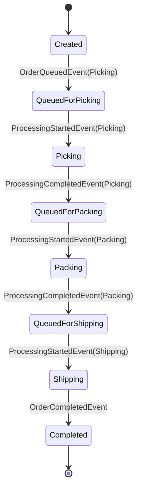

# Architecture -- FlowForge

## Table of Contents

- [1. Target Architecture](#1-target-architecture)
  - [1.1 Product Focus](#11-product-focus)
  - [1.2 Legend](#12-legend)
  - [1.3 Layer and Component Overview with Status](#13-layer-and-component-overview-with-status)
  - [1.4 Core Architecture Rules](#14-core-architecture-rules)
- [2. Capability Details and Feature List](#2-capability-details-and-feature-list)
  - [2.1 Domain Layer](#21-domain-layer)
- [2.2 Simulation Layer](#22-simulation-layer)
- [2.2.3 Proposed MVP Event and State Model](#223-proposed-mvp-event-and-state-model)
- [2.2.4 Proposed Snapshot Architecture](#224-proposed-snapshot-architecture)
- [2.2.5 Proposed Tracking and KPI Ownership Model](#225-proposed-tracking-and-kpi-ownership-model)
- [2.3 Application and Contracts](#23-application-and-contracts)
- [2.3.3 Proposed Checkpoint Contract Model](#233-proposed-checkpoint-contract-model)
- [2.4 Infrastructure Layer](#24-infrastructure-layer)
  - [2.5 Delivery Layer](#25-delivery-layer)
  - [2.6 Quality and Operations](#26-quality-and-operations)
- [3. Dependency Rules](#3-dependency-rules)
- [4. Runtime and Request Flows](#4-runtime-and-request-flows)
- [4.4 Proposed Order State Diagram](#44-proposed-order-state-diagram)
- [4.5 Proposed Event Flow](#45-proposed-event-flow)
- [4.6 Proposed Checkpoint Save and Load Flow](#46-proposed-checkpoint-save-and-load-flow)
- [5. Repository Structure](#5-repository-structure)
- [6. Architecture Decision Log](#6-architecture-decision-log)
- [7. Open Questions](#7-open-questions)

---

## 1. Target Architecture

### 1.1 Product Focus

FlowForge is a digital twin application for operational process flows.
The first product slice models a fulfillment pipeline that is easy to understand, visually strong,
and small enough for a two-person team to deliver iteratively.

Initial MVP process:

```text
Order Source -> Picking -> Packing -> Shipping -> Completed
```

FlowForge should make the following visible and understandable:

- order movement through stations
- queue growth and shrinkage
- worker utilization per station
- throughput and lead time behavior
- bottleneck formation under changing parameters

The product strategy is:

- desktop-first for the primary MVP experience
- early API support for control, queries, and future remote scenarios
- shared application/contracts so desktop and API use the same core data access surface

### 1.2 Legend

- 🟢 **GREEN** -- feature is present and usable
- 🟡 **YELLOW** -- feature exists in a starter form or is partially defined
- 🔴 **RED** -- feature is planned but not implemented yet

### 1.3 Layer and Component Overview with Status

```text
+----------------------------------------------------------------------------+
|                              DELIVERY LAYER                                |
|                                                                            |
|  🔴 Desktop Client         🟡 API Host             🟢 CLI Host             |
|  🔴 Process Visualization  🟡 Simulation Control   🟡 Debug Execution      |
|  🔴 KPI Dashboard          🔴 Snapshot Streaming   🔴 Admin Workflows      |
|  🔴 Bottleneck Highlight   🔴 Scenario Endpoints   🔴 Export Commands      |
+----------------------------------------------------------------------------+
|                         INFRASTRUCTURE LAYER                               |
|                                                                            |
|  🟡 DI Wiring              🔴 Scenario Persistence  🔴 Run Export           |
|  🔴 Replay Storage         🔴 Config Models         🔴 Observability        |
|  🔴 API Client Adapters    🔴 Realtime Transport    🔴 Database Support     |
+----------------------------------------------------------------------------+
|                     APPLICATION AND CONTRACTS                              |
|                                                                            |
|  🟡 Application Shell      🔴 Simulation Use Cases  🟡 Shared DTO Contracts |
|  🔴 Snapshot Queries       🔴 KPI Queries           🔴 Scenario Commands     |
|  🔴 Disturbance Commands   🔴 Result/Error Model    🔴 Validation Pipeline   |
+----------------------------------------------------------------------------+
|                           SIMULATION LAYER                                 |
|                                                                            |
|  🔴 Event Queue            🔴 Simulation Runner     🔴 Runtime State        |
|  🔴 Event Dispatch         🔴 Snapshot Builder      🔴 KPI Collection       |
|  🔴 Scheduling             🔴 Disturbance Handling  🔴 Replay Hooks         |
+----------------------------------------------------------------------------+
|                             DOMAIN LAYER                                   |
|                                                                            |
|  🟡 Domain Project         🔴 Order Model           🔴 Station Model        |
|  🔴 Scenario Model         🔴 Capacity Rules        🔴 Processing Profiles  |
|  🔴 Value Objects          🔴 Domain Invariants     🔴 Shared Vocabulary    |
+----------------------------------------------------------------------------+
|                        QUALITY AND OPERATIONS                              |
|                                                                            |
|  🟢 Unit Test Projects     🟢 CI Baseline           🟢 Docker Assets        |
|  🔴 Simulation Tests       🔴 Integration Tests     🔴 Demo Scenarios       |
|  🔴 Architecture Checks    🔴 Telemetry             🔴 Release Flow         |
+----------------------------------------------------------------------------+
```

High-level interaction model:

```text
Desktop Client   API Host   CLI Host
       \            |          /
        \           |         /
         +----------v--------+
         |  Application +    |
         |    Contracts      |
         +----+---------+----+
              |         |
              |         +------------------+
              v                            v
      +-------+--------+         +---------+--------+
      | Simulation     |         | Infrastructure   |
      | event runtime  |         | persistence/etc. |
      +-------+--------+         +------------------+
              |
              v
      +-------+--------+
      | Domain         |
      | business model |
      +----------------+
```

### 1.4 Core Architecture Rules

- The simulation owns the mutable runtime state.
- Desktop and API must consume the same application-facing contracts where practical.
- The UI must never bind directly to mutable simulation collections or runtime internals.
- The API must stay thin and forward use-case behavior inward instead of hosting business rules.
- The MVP should remain concrete and domain-specific instead of becoming a generic simulation engine.
- The current repository scaffold should evolve incrementally toward the target structure.

---

## 2. Capability Details and Feature List

This section lists the expected responsibilities of each component, the current status, and what is
still missing before FlowForge becomes the intended digital twin product.

---

## 2.1 Domain Layer

The domain layer contains the stable business language of FlowForge.
It models the fulfillment process independently from simulation runtime, UI, HTTP, and persistence.

### 2.1.1 Core Domain Modeling

> Business concepts and invariants for the fulfillment domain.

| Feature | Status | Description | What is missing |
|---|---|---|---|
| Domain project baseline | 🟡 | `FlowForge.Domain` exists as the correct place for core business concepts. | Replace placeholder structure with concrete logistics concepts and rules. |
| Order model | 🔴 | Orders should represent the units flowing through the simulated process. | Define identity, lifecycle, timestamps, and allowed state transitions. |
| Station / WorkCenter model | 🔴 | Stations such as Picking, Packing, and Shipping define processing points in the flow. | Model capacities, queue semantics, naming, and process ordering. |
| Scenario model | 🔴 | Scenarios define the configurable setup of a simulation run. | Define scenario identity, station configuration, processing parameters, and defaults. |
| Processing profile | 🔴 | Processing profiles capture expected handling durations and behavior per station. | Decide deterministic vs. stochastic timing and how parameters are expressed. |
| Worker capacity model | 🔴 | Capacity determines how many orders a station can process concurrently. | Introduce worker count, utilization semantics, and capacity-related invariants. |
| Strongly typed value objects | 🔴 | IDs and domain values should avoid primitive-heavy modeling. | Add types such as `OrderId`, `StationId`, `ScenarioId`, and domain-specific value objects. |

### 2.1.2 Domain Quality and Boundaries

> Rules that keep the business model expressive and independent.

| Feature | Status | Description | What is missing |
|---|---|---|---|
| Framework independence | 🟡 | The domain project is currently free from UI and infrastructure concerns. | Preserve this as modeling becomes richer and avoid ORM or transport leakage. |
| Shared business vocabulary | 🔴 | The domain should establish a single language for orders, stations, capacities, and scenarios. | Align namespaces, types, and method names with the agreed process vocabulary. |
| Invariant enforcement | 🔴 | Domain objects should defend valid state and legal transitions. | Move rules into entities/value objects instead of scattering them in handlers or hosts. |
| Extensibility toward richer flows | 🔴 | The model should allow later growth into disturbances, branching, or rework. | Keep the model concrete for MVP while identifying safe extension points. |

---

## 2.2 Simulation Layer

The simulation layer is the runtime heart of FlowForge.
It owns mutable execution state and advances the process through discrete events.

### 2.2.1 Runtime Engine

> Event-based runtime behavior and state transitions.

| Feature | Status | Description | What is missing |
|---|---|---|---|
| Simulation project | 🟡 | `FlowForge.Simulation` now exists as the dedicated home for runtime-engine concerns. | Add the first real runtime types, interfaces, and tests, and keep the dependency direction limited to `Domain`. |
| Event queue | 🟡 | The queue should order events deterministically by scheduled simulation time, event priority, and sequence number. | Finalize the exact ordering contract and queue implementation details. |
| Simulation runner | 🔴 | The runner advances simulation time by dequeuing and dispatching events. | Implement lifecycle control, stop/pause behavior, and safe completion semantics. |
| Simulation state | 🔴 | Mutable runtime state should hold active orders, station queues, counters, and current time. | Define internal state objects and keep them hidden from external consumers. |
| Event dispatching | 🟡 | The runtime direction now favors a small generic event family with routing based on event kind plus station/process context. | Define dispatcher strategy, handler lookup rules, and extension points for future event kinds. |
| Scheduling abstraction | 🟡 | Handlers should schedule follow-up events through a controlled API that assigns sequence numbers and priorities consistently. | Define an `ISimulationScheduler`, sequence generation, and invalidation behavior. |
| Core event types | 🟡 | The MVP event direction is now clearer and based on station-specific queue/start/completion events plus batch generation. | Finalize the concrete event payloads, timing rules, and handler responsibilities. |

### 2.2.2 Snapshots and KPIs

> Read models produced from mutable runtime state.

| Feature | Status | Description | What is missing |
|---|---|---|---|
| Snapshot builder | 🟡 | The direction is to build immutable snapshots from simulation state through a dedicated snapshot service owned by the simulation layer. | Finalize the exact snapshot schema, copy/reference rules, and publication flow. |
| Snapshot publication strategy | 🟡 | `SnapshotPublishedEvent` should trigger publication of a new immutable read model for clients. | Finalize cadence, retention, ownership, and fan-out strategy for desktop, API, and replay use cases. |
| KPI collector | 🟡 | KPI calculation should primarily be event- and state-driven, with KPI values embedded into published snapshots for consumers. | Finalize which KPIs are incremental, which are derived at publish time, and how history is stored efficiently. |
| Disturbance handling hooks | 🔴 | Later disturbances such as outages or shipping stops should integrate cleanly into the runtime. | Reserve extension points without overbuilding the MVP. |
| Replay support hooks | 🔴 | Later replay or timeline features may depend on run markers or event history. | Decide minimal runtime hooks that do not burden the initial MVP. |

### 2.2.3 Proposed MVP Event and State Model

#### Proposed order states

The simplest useful MVP state machine for an order is:

- `Created`
- `QueuedForPicking`
- `Picking`
- `QueuedForPacking`
- `Packing`
- `QueuedForShipping`
- `Shipping`
- `Completed`

Recommended rule:

- queue states are explicit
- processing states are explicit
- movement between stations is represented by generic queue/start/completion events plus station context, but not as a separate persistent movement state

This keeps KPIs and UI rendering simple because queue length and active work are directly readable
from state.

#### Proposed MVP event catalog

Recommended direction is now a generic event family with routing metadata.
This keeps the fixed MVP flow readable while staying extensible for future stations, disruptions,
shift changes, gates, and similar runtime behavior.

| Event | Purpose | Typical producer | Typical follow-up |
|---|---|---|---|
| `GenerateSimulationEvent` | Generates the next batch of incoming orders for a time slice. | Simulation bootstrap / generator | Create orders, enqueue `WorkItemQueueEvent`, schedule next generation batch |
| `WorkItemQueueEvent` | Places an order into a specific station queue. | Generator or routing logic after completion | Try start processing at the target station |
| `ProcessingStartEvent` | Starts processing one order at a specific station. | Station capacity logic | Schedule matching completion |
| `ProcessingCompleteEvent` | Finishes processing at a specific station. | Runner after scheduled delay | Route to next station queue or complete order |
| `WorkItemCompleteEvent` | Marks the order as fully completed. | Final-station completion logic | Update KPIs and counters |
| `SnapshotGenerateEvent` | Optional internal marker that a snapshot was produced. | Snapshot policy | Notify consumers / stream / cache |

#### Proposed event handling semantics

- `GenerateSimulationEvent` should be the first event scheduled when a simulation starts.
- The handler for `GenerateSimulationEvent` should create work items for the configured upcoming time slice.
- For each new work item, the generator should create the work item in status `Created` and then enqueue `WorkItemQueueEvent` targeted at the Picking station for the intended simulated time.
- After generating the current batch, the handler should schedule another `GenerateSimulationEvent` at the end of the next generation window as long as the scenario still produces incoming orders.
- `WorkItemQueueEvent` should carry the target station context, set the matching queue state, and trigger a capacity check for that station.
- `ProcessingStartEvent` should reserve a worker at the targeted station, stamp processing start time, increment the work item run version, and schedule the matching `ProcessingCompleteEvent`.
- `ProcessingCompleteEvent` should validate its run/version marker before applying state changes. Invalid or outdated completion events must be skipped safely.
- A valid `ProcessingCompleteEvent` should release capacity, update station counters and station timing history, and enqueue the next `WorkItemQueueEvent` or `WorkItemCompleteEvent`.
- `WorkItemCompleteEvent` should finalize timestamps, counters, and KPI contributions.

#### Why the generic event family is the recommended default

Advantages for the MVP:

- easier extension to additional stations without exploding the number of event types
- simpler support for future event categories such as disruptions, shifts, gates, or maintenance windows
- stable event family even if the process topology becomes configurable later
- consistent queue/started/completed semantics across all stations

Trade-off:

- routing can no longer rely only on the .NET event type
- handlers must inspect event context such as station and event kind

For FlowForge's longer-term direction, the extensibility benefits now outweigh the simpler routing of
station-specific event types.

#### Proposed routing model

The dispatcher should route events by a composite key instead of only by CLR type.

Recommended routing key shape:

```text
EventKind + ProcessStage + OptionalSubKind
```

Examples:

- `WorkItemQueue + Picking`
- `ProcessingStart + Packing`
- `ProcessingComplete + Shipping`
- `DisruptionRaise + Picking`
- `GateClose + Shipping`

Recommended dispatcher behavior:

- first identify the generic event family
- then inspect station/process-stage metadata
- resolve the matching handler or handler chain from a registry
- fail fast if no handler exists for a required routing key

This gives the system generic event types without giving up deterministic, explicit routing.

#### Proposed queue ownership and dispatch loop

Recommended ownership model:

- one simulation run owns exactly one mutable priority queue instance
- that queue lives inside the simulation runtime and is owned operationally by `SimulationRunner`
- handlers, generators, and future control logic must not mutate the raw queue directly
- external consumers must never read the mutable queue structure directly

Recommended component split:

| Component | Owns | May do | Must not do |
|---|---|---|---|
| `SimulationRunner` | main execution loop, dequeue step, simulation-time advancement, run lifecycle | dequeue due events, call dispatcher, stop when queue is empty or run is cancelled | expose the mutable queue to delivery/application layers |
| `ISimulationScheduler` | controlled queue write access | assign `SequenceNumber`, apply `SortRank`, enqueue follow-up events | dequeue events or mutate runtime state directly |
| `IEventDispatcher` | routing one dequeued event to the correct handler pipeline | resolve handler from registry and invoke it | own the main loop or manage queue ordering |
| `ISimulationEventHandler<TEvent>` | mutation logic for one routed event kind/context | update state/tracking and schedule follow-up events through the scheduler | read/write the raw queue collection directly |

Recommended access rules:

- writes into the priority queue happen only through `ISimulationScheduler`
- the initial bootstrap step also uses `ISimulationScheduler` to enqueue the first `GenerateSimulationEvent`
- event handlers should not receive raw queue access; they should receive only a handler-facing context with `ISimulationScheduler`
- reads from the queue for execution happen only in `SimulationRunner`
- diagnostic read access, if needed later, should come from derived metrics such as queue length or a debug projection, not from exposing queue internals

Recommended implementation safety rule:

- use one concrete run-scoped queue adapter such as `SimulationQueue`
- that single object may implement both `ISimulationEventQueue` and `ISimulationScheduler`
- the same instance can therefore be stored twice in the run wiring: once as read/dequeue interface for the runner and once as write/schedule interface for handlers
- safety comes from interface segregation and API exposure, not from two physically different queue objects
- handlers should never see the `ISimulationEventQueue` reference at all

Recommended main-loop location:

- the dequeue-and-dispatch loop should live in `FlowForge.Simulation` inside a type such as `SimulationRunner`
- the application layer starts or stops the runner through a use case, but does not host the loop itself
- API, CLI, and desktop only trigger lifecycle use cases and consume snapshots/results

#### Proposed `SimulationExecutionContext` ownership and structure

The recommended model is that one simulation run has one root execution context object.
That root context bundles the mutable runtime collaborators and run-scoped immutable metadata needed
for one execution. However, handlers should receive a narrower handler-facing context so the raw queue
is not exposed to them.

Naming rule:

- `SimulationExecutionContext` is the live simulation-internal execution shell used by runner and dispatcher
- `SimulationExecutionState` in `FlowForge.Simulation` is the technical cross-layer document used for checkpoint save/load and orchestration

Recommended owner:

- the simulation run owns one `SimulationExecutionContext`
- operationally, `SimulationRunner` uses that context while the run is active
- lifecycle creation belongs to a simulation-side factory or run builder, not to handlers
- handlers may use a derived handler-facing context passed to them, but they do not own it and must not replace it

Recommended creation location:

- `FlowForge.Application` orchestrates `StartSimulation`
- it loads the scenario and asks the simulation layer to create a run
- inside `FlowForge.Simulation`, a factory such as `ISimulationRunFactory` creates `SimulationState`, queue, scheduler, dispatcher, registry, tracking stores, KPI collector, and the `SimulationExecutionContext`
- the same factory performs bootstrap scheduling of the first event before the runner starts

Recommended handoff into `RunAsync`:

```text
StartSimulation use case
  -> load ProcessConfiguration
  -> call ISimulationRunFactory.Create(processConfiguration, options)
  -> factory builds SimulationExecutionContext
  -> factory enqueues first GenerateSimulationEvent through ISimulationScheduler
  -> application calls ISimulationRunner.RunAsync(executionContext, cancellationToken)
```

Recommended rule:

- `RunAsync` receives a fully initialized context
- `RunAsync` should not assemble core collaborators ad hoc
- this keeps construction separate from execution and makes tests easier because a prepared context can be injected directly

Recommended minimal structure:

```csharp
public sealed class SimulationExecutionContext
{
    public Guid SimulationRunId { get; init; }
    public ProcessConfiguration ProcessConfiguration { get; init; } = default!;
    public SimulationMetadata Metadata { get; init; } = default!;
    public SimulationState State { get; init; } = default!;
    public ISimulationEventQueue EventQueue { get; init; } = default!;
    public ISimulationScheduler Scheduler { get; init; } = default!;
    public IEventDispatcher Dispatcher { get; init; } = default!;
    public IEventHandlerRegistry HandlerRegistry { get; init; } = default!;
    public IWorkItemTrackingStore WorkItemTrackingStore { get; init; } = default!;
    public IStationTrackingStore StationTrackingStore { get; init; } = default!;
    public IKpiCollector KpiCollector { get; init; } = default!;
    public ISnapshotBuilder SnapshotBuilder { get; init; } = default!;
    public ISnapshotStore SnapshotStore { get; init; } = default!;
    public ISnapshotTimelineStore SnapshotTimelineStore { get; init; } = default!;

    public SimulationExecutionHandlerContext CreateHandlerContext() => new()
    {
        SimulationRunId = SimulationRunId,
        ProcessConfiguration = ProcessConfiguration,
        Metadata = Metadata,
        State = State,
        Scheduler = Scheduler,
        WorkItemTrackingStore = WorkItemTrackingStore,
        StationTrackingStore = StationTrackingStore,
        KpiCollector = KpiCollector,
        SnapshotBuilder = SnapshotBuilder,
        SnapshotStore = SnapshotStore,
        SnapshotTimelineStore = SnapshotTimelineStore
    };
}

public sealed class SimulationExecutionHandlerContext
{
    public Guid SimulationRunId { get; init; }
    public ProcessConfiguration ProcessConfiguration { get; init; } = default!;
    public SimulationMetadata Metadata { get; init; } = default!;
    public SimulationState State { get; init; } = default!;
    public ISimulationScheduler Scheduler { get; init; } = default!;
    public IWorkItemTrackingStore WorkItemTrackingStore { get; init; } = default!;
    public IStationTrackingStore StationTrackingStore { get; init; } = default!;
    public IKpiCollector KpiCollector { get; init; } = default!;
    public ISnapshotBuilder SnapshotBuilder { get; init; } = default!;
    public ISnapshotStore SnapshotStore { get; init; } = default!;
    public ISnapshotTimelineStore SnapshotTimelineStore { get; init; } = default!;
}

public sealed record SimulationMetadata(
    DateTimeOffset CreatedAtUtc,
    string ScenarioKey,
    string EngineVersion,
    SimulationRunOptions Options);
```

Recommended interpretation:

- `SimulationRunId` identifies one concrete execution and scopes queue entries, snapshots, and diagnostics
- `ProcessConfiguration` is the immutable process topology and arrival definition for the run
- `Metadata` holds run-scoped descriptive information that is not part of mutable execution state
- `State` holds mutable simulation state such as current simulated time, active work items, and station occupancy
- `EventQueue` is the run-local mutable priority queue and is runner-facing only
- `Scheduler` is the only write gateway into `EventQueue`
- `Dispatcher` resolves and invokes handlers for dequeued events
- `HandlerRegistry` is the immutable routing table built at startup
- tracking, KPI, and snapshot services are run-scoped collaborators used during execution and publication

Recommended visibility rule:

- `SimulationExecutionContext` is for runner/dispatcher/factory internals
- `SimulationExecutionHandlerContext` is the only context shape handed to event handlers
- this keeps queue dequeue access out of handler APIs even if one concrete queue object implements both interfaces internally

Recommended ownership boundary inside the context:

- the context is a composition root object for one run, not a business object on its own
- ownership of the contained components stays with their dedicated abstractions, e.g. `SimulationState` still owns mutable state and `ISnapshotStore` still owns published snapshots
- the context simply keeps those run-scoped pieces together so they can move through runner and dispatcher APIs as one unit

Recommended factory direction:

```csharp
    public interface ISimulationRunFactory
    {
    SimulationExecutionContext Create(
        ProcessConfiguration processConfiguration,
        SimulationRunOptions options);
    }
```

Recommended implementation rule:

- the factory should wire the queue, scheduler, dispatcher, handler registry, tracking stores, and snapshot services once per run
- the factory may create one concrete `SimulationQueue` object that implements both `ISimulationEventQueue` and `ISimulationScheduler`
- the factory should expose that same object through two different interface references, `EventQueue` and `Scheduler`
- only the runner-facing root context should keep the `EventQueue` reference
- handler-facing contexts should keep only the `Scheduler` reference
- the factory should bootstrap the first scheduled event through `ISimulationScheduler`
- after that, only `SimulationRunner` advances the run and only `ISimulationScheduler` appends further events

One concrete runtime shape could look like this:

```csharp
public interface ISimulationRunner
{
    Task<SimulationRunResult> RunAsync(
        SimulationExecutionContext context,
        CancellationToken cancellationToken);
}
```

```csharp
public sealed class SimulationRunner : ISimulationRunner
{
    public async Task<SimulationRunResult> RunAsync(
        SimulationExecutionContext context,
        CancellationToken cancellationToken)
    {
        while (context.EventQueue.TryDequeue(out var nextEvent))
        {
            cancellationToken.ThrowIfCancellationRequested();

            context.State.AdvanceTo(nextEvent.ScheduledTime);
            await context.Dispatcher.DispatchAsync(
                nextEvent,
                context.CreateHandlerContext(),
                cancellationToken);
        }

        return SimulationRunResult.Completed(context.State.CurrentTime);
    }
}
```

Recommended dispatch handoff:

1. `SimulationRunner` dequeues the next due event from the priority queue.
2. `SimulationRunner` advances `SimulationState.CurrentTime` to that event time.
3. `SimulationRunner` calls `IEventDispatcher.DispatchAsync(event, handlerContext, cancellationToken)`.
4. `IEventDispatcher` resolves the registered handler using the event routing key.
5. The resolved handler mutates runtime state and schedules follow-up events through `ISimulationScheduler`.

Recommended handler resolution model:

- the dispatcher should build or receive a registry during run startup
- the registry key should be `EventRoutingKey(EventKind, StageId or ProcessStage, SubKind)`
- exact-match lookup is the default behavior for required runtime events
- optional fallback handlers may be allowed only for stage-agnostic events such as `Generate + None` or `SnapshotPublished + None`
- missing required handlers should fail fast because silent dropping would corrupt the simulation run

One concrete registry direction could look like this:

```csharp
public readonly record struct EventRoutingKey(
    EventKind EventKind,
    Guid? StageId,
    string? SubKind = null);

public interface IEventHandlerRegistry
{
    ISimulationEventHandler Resolve(EventRoutingKey key);
}
```

Recommended registration flow:

- handler registrations are assembled when the run is created, typically from DI plus simulation-specific registration code
- the registry is then treated as immutable for the lifetime of the run
- the dispatcher performs only lookup and invocation, not dynamic registration during execution
- this keeps routing deterministic and makes missing coverage visible immediately

#### Proposed queue ordering contract

The priority queue should order events by the following fields in this order:

1. `ScheduledTime`
2. `SortRank`
3. `SequenceNumber`

Meaning:

- earlier simulation time always wins
- for the same time, higher-priority event classes must run first
- for the same time and priority, lower sequence number wins to keep execution deterministic

Recommended default priority idea:

| Sort rank band | Purpose |
|---|---|
| `10` | Completion-style events such as `ProcessingCompletedEvent`, `OrderCompletedEvent`, later `DisruptionRaisedEvent` / `DisruptionClearedEvent` |
| `20` | Queueing and routing events such as `OrderQueuedEvent` |
| `30` | Start events such as `ProcessingStartedEvent` |
| `40` | Generation and maintenance events such as `GenerateSimulationEvent` |

The exact numeric values are less important than keeping the ordering contract explicit and easy to extend.

#### Proposed priority rules

Recommended default ordering at the same `ScheduledTime`:

1. `ProcessingCompletedEvent`
2. `OrderCompletedEvent`
3. future interruption events such as `DisruptionRaisedEvent` / `DisruptionClearedEvent`
4. `OrderQueuedEvent`
5. `ProcessingStartedEvent`
6. `GenerateSimulationEvent`
7. `SnapshotPublishedEvent`

Reasoning:

- completion must happen before new starts so released capacity is visible immediately
- queueing should happen before start attempts so newly routed orders are visible to station logic
- generation should come after current-cycle completions and routing, avoiding accidental precedence of newly spawned work
- snapshot publication should usually observe the already-applied state for that simulated timestamp

Implementation recommendation:

- define one central sort-rank policy in the scheduler or a dedicated `IEventSortRankPolicy`
- do not let individual handlers assign arbitrary numeric priorities ad hoc
- keep priorities stable across the whole engine so debugging remains predictable

#### Proposed minimal event payload direction

#### Proposed base event contract

Recommended baseline shape:

```csharp
public abstract record SimulationEvent(
    Guid EventId,
    Guid SimulationRunId,
    long SequenceNumber,
    EventSortRank SortRank,
    EventKind EventKind,
    ProcessStage ProcessStage,
    TimeSpan ScheduledTime,
    Guid? OrderId,
    long? ProcessingToken,
    string? SubKind = null);
```

Interpretation of the most important fields:

- `EventId` is a technical identifier for tracing, logging, and debugging.
- `SimulationRunId` scopes all events to one full simulation execution.
- `SequenceNumber` is assigned centrally by the scheduler and guarantees deterministic ordering.
- `SortRank` defines the cross-cutting execution order for event classes.
- `EventKind` identifies the generic event family.
- `ProcessStage` identifies the targeted process stage.
- `OrderId` is optional because generator or maintenance events may not target one concrete order.
- `ProcessingToken` is optional for non-order events and required for execution events so outdated completions can be skipped.
- `SubKind` is an escape hatch for future specialization such as disruption types or gate reasons.

#### Proposed enum model

Recommended enums for the first implementation:

```csharp
public enum EventKind
{
    Generate = 0,
    OrderQueued = 1,
    ProcessingStarted = 2,
    ProcessingCompleted = 3,
    OrderCompleted = 4,
    SnapshotPublished = 5,
    DisruptionRaised = 100,
    DisruptionCleared = 101
}

public enum ProcessStage
{
    None = 0,
    Picking = 1,
    Packing = 2,
    Shipping = 3
}

public enum EventSortRank
{
    Highest = 0,
    Completion = 10,
    Routing = 20,
    Start = 30,
    Generation = 40,
    Snapshot = 50,
    Lowest = 100
}
```

Recommended rules:

- `EventKind` should model semantic intent, not execution order.
- `ProcessStage` should stay small and business-readable.
- `EventSortRank` should express ordering policy explicitly instead of hiding it in arbitrary numbers.
- future stages can be added without changing the base event family.

All simulation events should likely share a common base payload such as:

| Field | Purpose |
|---|---|
| `EventId` | Unique technical identifier for tracing and deterministic ordering |
| `ScheduledTime` | Simulation timestamp at which the event becomes due |
| `SortRank` | Tie-breaker when several events share the same simulation time |
| `SequenceNumber` | Preserves deterministic ordering when time and priority are equal |
| `SimulationRunId` | Correlates events to one simulation run |
| `ProcessingToken` | Correlates an event to the current processing run/version so outdated completions can be skipped |
| `EventKind` | Identifies the generic event family used for routing |
| `ProcessStage` | Identifies the targeted stage such as Picking, Packing, or Shipping |

Station- and order-related events should additionally carry targeted business data such as:

| Event family | Suggested payload |
|---|---|
| `GenerateSimulationEvent` | generation window start/end, batch settings reference, optional scenario snapshot/version |
| `OrderQueuedEvent` | `OrderId`, target `StationId`, queue-entered timestamp |
| `ProcessingStartedEvent` | `OrderId`, `StationId`, assigned worker slot or capacity token, processing duration |
| `ProcessingCompletedEvent` | `OrderId`, `StationId`, processing-start timestamp, processing-end timestamp |
| `OrderCompletedEvent` | `OrderId`, completion timestamp |

Recommended default for the first implementation:

- keep event payloads small and explicit
- do not place full aggregate snapshots inside events
- prefer identifiers plus the minimal deterministic data needed by the handler
- let `SimulationState` remain the source of broader runtime context

#### Proposed invalidation and skip model

The current recommended approach is version-based invalidation through `ProcessingToken`.

Recommended rule set:

- each order keeps a mutable current `ProcessingToken` in simulation state
- `OrderQueuedEvent` does not need to increment the token by default
- `ProcessingStartedEvent` increments `ProcessingToken` when work for that station actually begins
- the scheduled `ProcessingCompletedEvent` stores the exact `ProcessingToken` that was current when the processing started
- when a `ProcessingCompletedEvent` is dequeued, the handler compares the event `ProcessingToken` with the current order `ProcessingToken`
- if they differ, the event is stale and must be skipped without mutating state

This supports later cases such as:

- process interruption after a started operation
- work being re-queued with a new run/version
- cancellation or replacement of a previously scheduled completion

Recommended skip behavior for stale events:

- log them at debug or trace level
- count them in diagnostics if useful
- do not treat them as runtime failures
- never mutate station counters, order state, or KPI tracking from a stale completion

#### Proposed routing contract example

One concrete routing model could look like this:

```csharp
public readonly record struct EventRoutingKey(
    EventKind EventKind,
    ProcessStage ProcessStage,
    string? SubKind = null);
```

And handlers could be registered against routing keys such as:

- `Generate + None`
- `OrderQueued + Picking`
- `OrderQueued + Packing`
- `ProcessingStarted + Shipping`
- `ProcessingCompleted + Packing`

This keeps the generic event family while still allowing explicit stage-aware dispatch.

#### Proposed order timing history requirements

To support later KPIs, each order or associated order-tracking structure should capture enough
station-level history to answer at least these questions:

- when did the order enter each station queue?
- how long did it wait in each queue?
- when did processing start at each station?
- how long did processing take at each station?
- when did the order leave each station?
- what was the total lead time for the run?

Recommended direction:

- keep the event payload small
- persist detailed timing history in `SimulationState` or a dedicated order-run tracking object
- update that tracking object during queue/start/completion handling
- derive KPIs from this accumulated tracking data rather than reconstructing history only from final snapshots

#### Proposed exclusions from the first MVP event model

These should stay out of the initial model unless they become necessary during implementation:

- separate movement/animation events only for UI purposes
- failure or outage events
- priority-preemption events
- inventory reservation events
- explicit pause/resume runtime events inside the domain model

### 2.2.4 Proposed Snapshot Architecture

#### Recommended direction

Recommended publication flow:

```text
SimulationState + OrderTracking + StationTracking
  -> KPI collector / derived metrics
  -> Snapshot builder
  -> immutable SimulationSnapshot
  -> snapshot store / latest snapshot reference
  -> Desktop / API / replay consumers
```

Recommended default:

- KPIs should be maintained incrementally during simulation execution
- the snapshot builder should read the latest KPI aggregates and embed them into the published snapshot
- UIs and API consumers should read KPI values from the snapshot instead of recalculating them from raw state

Why this is the better default:

- one consistent KPI view for all consumers
- less duplicated calculation logic in desktop, API, and future replay features
- lower risk of consumers showing different values for the same simulation time
- predictable runtime cost because KPI work is centralized

Trade-off:

- the simulation layer owns more responsibility
- the KPI collector and snapshot builder must stay efficient and well-structured

#### Ownership model

Recommended ownership boundaries:

- `SimulationState` owns mutable runtime state
- `OrderTracking` and `StationTracking` own detailed timing and history data used for KPIs
- `IKpiCollector` owns incremental KPI aggregation
- `ISnapshotBuilder` owns transformation into immutable read models
- `ISnapshotStore` or equivalent owns the latest snapshot reference and optional short retention history
- delivery hosts never own or mutate snapshot contents

Recommended owner of the snapshot lifecycle:

- the simulation layer should own snapshot creation and publication
- the application layer should expose snapshot access through use cases and contracts
- the API and desktop should only consume published snapshots

#### Proposed snapshot publication semantics

`SnapshotPublishedEvent` should not carry the full snapshot payload.
It should act as a signal that the engine has reached a publish point and that a fresh immutable snapshot must now be built from the current state.

Recommended handling flow:

1. runner dequeues `SnapshotPublishedEvent`
2. snapshot handler reads the current `SimulationState`
3. snapshot handler reads the current KPI aggregates
4. snapshot builder creates a new immutable snapshot object graph
5. snapshot store atomically replaces the `latest snapshot`
6. subscribers or polling consumers observe the new snapshot

This keeps event payloads small and avoids placing large object graphs into the queue.

#### Proposed snapshot root structure

Recommended root contract shape:

```csharp
public sealed record SimulationSnapshot(
    Guid SimulationRunId,
    long SnapshotSequence,
    TimeSpan SimulationTime,
    SimulationStatus Status,
    ScenarioSnapshot Scenario,
    ProcessSnapshot Process,
    KpiSnapshot Kpis,
    AlertSnapshot Alerts,
    SnapshotMetadata Metadata);
```

Recommended interpretation:

- `SimulationRunId` links the snapshot to one run
- `SnapshotSequence` gives consumers a monotonic ordering independent of event sequence numbers
- `SimulationTime` is the business time visible to users
- `Status` captures run state such as running, paused, completed, aborted
- `Scenario` contains the scenario data relevant for read access
- `Process` contains stations, visible orders, queues, and flow status
- `Kpis` contains already computed metrics for direct consumption
- `Alerts` is a placeholder for later warnings and disruptions
- `Metadata` contains technical publication details

#### Proposed snapshot data structures

Recommended decomposition:

| Structure | Purpose | Notes |
|---|---|---|
| `ScenarioSnapshot` | Read-only scenario parameters relevant to consumers | Should not expose mutable scenario internals |
| `ProcessSnapshot` | Main operational view of the flow | Groups stations, active orders, and global counters |
| `StationSnapshot` | Per-station operational state | Queue length, worker counts, utilization, current load, processed count |
| `WorkItemSnapshot` | Per-work-item view needed for rendering and inspection | Current state, current stage/station, timestamps, progress, optional recent timings |
| `KpiSnapshot` | Current KPI values and small recent trends | Precomputed values for desktop and API |
| `AlertSnapshot` | Current active warnings or later disruptions | Can remain minimal for the MVP |
| `SnapshotMetadata` | Technical publication metadata | Publish timestamp, snapshot reason, producer version |

#### Copy vs. reference rules

Recommended default rule:

- snapshots must be logically immutable and self-contained for consumers
- mutable runtime collections must never be exposed by reference
- small scalar values and compact records should be copied into the snapshot
- large static scenario/layout data may be referenced only if it is itself immutable for the full run

Recommended practical split:

| Data category | Copy or reference | Reason |
|---|---|---|
| Current station counters, queue lengths, busy workers | Copy | These values are mutable and must be frozen per snapshot |
| Current order state and visual/progress data | Copy | UIs need a stable point-in-time view |
| KPI values | Copy | Consumers must see one consistent metric set per snapshot |
| Scenario metadata that never changes during a run | Reference allowed if immutable | Avoid repeated allocations for large static configuration |
| Static process layout used only for rendering | Reference allowed if immutable | Good candidate for shared run-scoped immutable objects |
| Internal tracking objects and runtime queues | Never reference | These are mutable engine internals |

Recommended safety rule:

- only reference data that is guaranteed immutable for the lifetime of the simulation run
- everything else is copied into the published snapshot

#### Proposed snapshot management strategy

Recommended default for MVP:

- keep one authoritative latest snapshot for live readers
- additionally keep a run-scoped snapshot timeline for playback-oriented consumers such as the desktop UI
- allow the timeline store to keep all published snapshots of the run when the publish cadence is coarse enough for MVP use
- use bounded retention or compaction only when snapshot cadence or run length would otherwise become too large

Recommended owner and access pattern:

- `ISnapshotStore` holds the latest snapshot reference
- `ISnapshotTimelineStore` or equivalent holds the ordered playback timeline for the current run
- replacement of the latest snapshot should be atomic, e.g. swap whole snapshot reference instead of mutating internals
- desktop can consume snapshots from the timeline at its own playback speed instead of being forced to render the newest snapshot immediately
- API can expose both `latest snapshot` and timeline/range queries
- later streaming can publish snapshot references or serialized payloads after the atomic swap

This approach is good for performance because:

- readers never lock mutable engine state
- writers create a new immutable object graph and then swap one reference
- live consumers remain simple because they can always read `latest`
- playback consumers remain decoupled because they can read from the stored timeline at a slower wall-clock pace

Recommended MVP note:

- if snapshots are published only every in-simulation hour, a full-day run produces a very small timeline and storing all snapshots in memory is acceptable
- retention strategy becomes a scaling concern only when publish cadence is much finer or runs become much longer

#### Proposed performance and memory strategy

Recommended MVP strategy:

- optimize first for correctness, determinism, and low reader complexity
- use immutable record-like DTOs for published snapshots
- avoid deep-cloning the full simulation state when only a smaller read model is needed
- keep heavy analytics history outside the snapshot root unless the UI actually needs it
- distinguish clearly between live-read access (`latest snapshot`) and playback access (`snapshot timeline`)

Recommended memory posture:

- snapshot should contain only renderable and query-relevant data
- detailed order timing history stays in tracking structures, not in every published snapshot
- large per-order historical arrays should not be copied into UI-facing snapshots by default
- trend data in `KpiSnapshot` should remain compact, e.g. small windows or pre-aggregated values
- if the desktop needs historical playback, prefer storing multiple compact snapshots over exposing mutable runtime history directly

#### Proposed KPI placement strategy

Recommended default:

- calculate KPI inputs continuously during event handling
- maintain incremental aggregates in the KPI collector
- finalize snapshot-facing KPI values during snapshot build
- store the resulting KPI values directly inside `KpiSnapshot`

This yields a good separation:

- runtime events update facts and aggregates
- snapshot publication produces one consumer-facing KPI view
- UIs and APIs stay dumb and consistent

#### Proposed snapshot fields for the MVP

Minimal but useful first snapshot content:

- simulation run id
- snapshot sequence
- simulation time
- simulation status
- total orders created and completed
- WIP count
- one `StationSnapshot` per station with queue length, worker counts, busy workers, processed count, utilization
- one `WorkItemSnapshot` per active work item with tracking subject id, state, current stage, entered-at, started-at, progress
- KPI values for throughput, average lead time, queue lengths, utilization, bottleneck indicator

#### Proposed exact snapshot structures

Recommended root and child DTOs for the MVP:

```csharp
public sealed record SimulationSnapshot(
    Guid SimulationRunId,
    long SnapshotSequence,
    TimeSpan SimulationTime,
    SimulationStatus Status,
    ScenarioSnapshot Scenario,
    ProcessSnapshot Process,
    KpiSnapshot Kpis,
    AlertSnapshot Alerts,
    SnapshotMetadata Metadata);

public sealed record ScenarioSnapshot(
    string ScenarioId,
    string Name,
    TimeSpan PlannedDuration,
    ArrivalProfileSnapshot ArrivalProfile,
    IReadOnlyList<StageConfigurationSnapshot> Stages);

public sealed record ArrivalProfileSnapshot(
    TimeSpan GenerationWindow,
    int AverageOrdersPerWindow,
    int? MaxOrdersPerWindow);

public sealed record StageConfigurationSnapshot(
    Guid StageId,
    string StageKey,
    string DisplayName,
    int Sequence,
    IReadOnlyList<StationConfigurationSnapshot> Stations);

public sealed record StationConfigurationSnapshot(
    Guid StationId,
    string StationKey,
    string DisplayName,
    int WorkerCount,
    TimeSpan AverageProcessingTime);

public sealed record ProcessSnapshot(
    int OrdersCreated,
    int OrdersCompleted,
    int WorkInProgress,
    IReadOnlyList<StationSnapshot> Stations,
    IReadOnlyList<WorkItemSnapshot> ActiveWorkItems,
    Guid? BottleneckStageId);

public sealed record StationSnapshot(
    Guid StageId,
    Guid StationId,
    string StageKey,
    string StationKey,
    string DisplayName,
    int QueueLength,
    int WorkerCount,
    int BusyWorkers,
    int FreeWorkers,
    int OrdersProcessed,
    double Utilization,
    TimeSpan AverageQueueWait,
    TimeSpan AverageProcessingTime,
    bool IsBottleneck);

public sealed record WorkItemSnapshot(
    Guid TrackingSubjectId,
    WorkItemStatus Status,
    Guid? CurrentStageId,
    Guid? CurrentStationId,
    TimeSpan CreatedAt,
    TimeSpan? QueueEnteredAt,
    TimeSpan? ProcessingStartedAt,
    TimeSpan TimeInSystem,
    double Progress,
    string? VisualLane);

public sealed record KpiSnapshot(
    ThroughputKpiSnapshot Throughput,
    LeadTimeKpiSnapshot LeadTime,
    WipKpiSnapshot WorkInProgress,
    BottleneckKpiSnapshot Bottleneck,
    IReadOnlyList<StageKpiSnapshot> StageMetrics,
    IReadOnlyList<KpiTrendPointSnapshot> TrendPoints);

public sealed record ThroughputKpiSnapshot(
    int CompletedOrders,
    double OrdersPerSimulatedHour,
    double OrdersPerSimulatedDay);

public sealed record LeadTimeKpiSnapshot(
    TimeSpan Average,
    TimeSpan Min,
    TimeSpan Max);

public sealed record WipKpiSnapshot(
    int Current,
    int Peak);

public sealed record BottleneckKpiSnapshot(
    Guid? StageId,
    string? StageName,
    double Score,
    string Reason);

public sealed record StageKpiSnapshot(
    Guid StageId,
    string StageKey,
    string StageName,
    int QueueLength,
    TimeSpan AverageQueueWait,
    TimeSpan AverageProcessingTime,
    double Utilization,
    int OrdersProcessed);

public sealed record KpiTrendPointSnapshot(
    TimeSpan SimulationTime,
    int WorkInProgress,
    double ThroughputPerHour);

public sealed record AlertSnapshot(
    IReadOnlyList<AlertEntrySnapshot> ActiveAlerts);

public sealed record AlertEntrySnapshot(
    string Code,
    string Severity,
    string Message,
    Guid? StageId);

public sealed record SnapshotMetadata(
    DateTimeOffset PublishedAtUtc,
    string PublishReason,
    int SchemaVersion);
```

#### Proposed exact KPI definitions and calculation model

Recommended KPI set for the MVP:

| KPI | Definition | Calculation approach |
|---|---|---|
| Throughput | Completed orders per simulated time unit | `completed orders / elapsed simulated time` |
| Average lead time | Mean duration from `CreatedAt` to completion | Average across completed orders |
| WIP | Orders currently not completed | `created - completed` or count of active orders |
| Queue length per stage | Orders currently waiting in a station queue | Current queue count in station state |
| Average queue wait per stage | Mean waiting time before processing starts at a stage | Derived from station/order tracking history |
| Average processing time per stage | Mean actual processing duration at a stage | Derived from completion history |
| Utilization per stage | Busy worker time divided by available worker time | `cumulative busy time / (worker count * elapsed simulated time)` |
| Bottleneck indicator | Stage most constrained at the snapshot time | Highest score based on queue pressure and utilization |

Recommended calculation split:

- event handlers update raw facts and cumulative counters
- KPI collector maintains rolling aggregates
- snapshot builder reads current aggregate values and emits consumer-friendly KPI DTOs

Recommended raw values to maintain continuously:

| Raw value | Used for |
|---|---|
| `OrdersCreated` | WIP, throughput context |
| `OrdersCompleted` | Throughput, WIP |
| Sum of completed lead times | Average lead time |
| Min/max completed lead time | Lead time range |
| Current active order count | WIP current |
| Peak active order count | WIP peak |
| Queue entry and processing start timestamps per stage/order | Queue wait calculation |
| Processing start and completion timestamps per stage/order | Processing duration calculation |
| Cumulative busy time per stage | Utilization |
| Processed order count per stage | Stage throughput and averages |

Recommended formulas:

```text
ThroughputPerHour = OrdersCompleted / max(ElapsedSimulationHours, epsilon)

AverageLeadTime = SumCompletedLeadTimes / max(OrdersCompleted, 1)

CurrentWip = OrdersCreated - OrdersCompleted

StageUtilization = StageBusyTime / max(StageWorkerCount * ElapsedSimulationTime, epsilon)

AverageQueueWait(stage) = SumQueueWaits(stage) / max(StartedProcessCount(stage), 1)

AverageProcessingTime(stage) = SumProcessingDurations(stage) / max(CompletedProcessCount(stage), 1)
```

#### Proposed bottleneck scoring for the MVP

Recommended simple heuristic for the first implementation:

```text
BottleneckScore(stage) =
    QueueLengthWeight * NormalizedQueueLength
  + UtilizationWeight * NormalizedUtilization
```

Suggested MVP defaults:

- `QueueLengthWeight = 0.6`
- `UtilizationWeight = 0.4`

Interpretation:

- queue pressure should dominate slightly because it is visually intuitive
- utilization adds stability when queue lengths are temporarily similar across stages

#### Recommended snapshot timeline behavior for the desktop

The desktop should not be forced to consume only the latest snapshot.

Recommended model:

- the simulation may produce snapshots as fast as needed in simulated time
- the run snapshot timeline stores those snapshots in simulation order
- the desktop playback controller reads that timeline at a user-facing wall-clock rate
- `latest snapshot` remains useful for monitoring, while the timeline supports presentation pacing

This cleanly separates:

- simulation speed
- snapshot publication cadence
- desktop playback speed

Fields that should stay out of the first published snapshot unless needed:

- full per-order station history
- raw event history
- internal queue structures
- engine-only counters with no consumer value

### 2.2.5 Proposed Tracking and KPI Ownership Model

> Proposed baseline for review. This section defines where detailed runtime facts live, who updates them, when KPI aggregates are recalculated, and who triggers snapshot-facing KPI publication.

#### Recommended ownership boundaries

Recommended ownership split inside the simulation layer:

| Component | Owns | Does not own |
|---|---|---|
| `SimulationState` | current mutable runtime state, active orders, station queues, current simulation time, worker occupancy, current counters | historical KPI aggregates, published snapshots |
| `OrderTrackingStore` | per-order and per-order-run timing history across stations | snapshot publication, station-global aggregates |
| `StationTrackingStore` | per-station cumulative timings and counters | published snapshot lifecycle, UI-facing DTOs |
| `IKpiCollector` | derived KPI aggregates and bottleneck scoring inputs | raw mutable queues, published snapshot retention |
| `ISnapshotBuilder` | transformation from state + tracking + KPIs into immutable DTOs | runtime mutation, KPI ownership |
| `ISnapshotStore` / `ISnapshotTimelineStore` | published snapshot retention and access | simulation-state mutation, KPI calculations |

Recommended principle:

- facts are written once close to the event that creates them
- aggregates are updated incrementally from those facts
- snapshots only read from state, tracking, and aggregates; they do not invent missing facts

#### Proposed `WorkItemTracking` structure

The previously simpler `one stage -> one visit` model is not sufficient once work items can:

- be re-queued
- be put on hold and later resumed
- move between parallel station queues of the same stage
- revisit the same stage in future extensions such as rework

Recommended direction is therefore segment-based tracking instead of one timestamp set per stage.
The tracking aggregate should now move to neutral work-item terminology and use configured stage identities instead of a hard-coded `ProcessStage` enum.

Recommended shape:

```csharp
public sealed class WorkItemTracking
{
    public Guid TrackingSubjectId { get; init; }
    public long CurrentProcessingToken { get; private set; }
    public TimeSpan CreatedAt { get; init; }
    public TimeSpan? CompletedAt { get; private set; }
    public WorkItemStatus CurrentStatus { get; private set; }
    public Guid? CurrentStageId { get; private set; }
    public IReadOnlyList<WorkItemTrackingSegment> Segments { get; }
    public TimeSpan? TotalLeadTime { get; private set; }
}

public sealed class WorkItemTrackingSegment
{
    public long SegmentId { get; init; }
    public long ProcessingToken { get; init; }
    public Guid? StageId { get; init; }
    public Guid StationId { get; init; }
    public TrackingSegmentType SegmentType { get; init; }
    public TimeSpan StartedAt { get; init; }
    public TimeSpan? EndedAt { get; private set; }
    public TimeSpan? Duration { get; private set; }
    public string? Reason { get; init; }
}

public sealed class TrackingSubjectReference
{
    public Guid TrackingSubjectId { get; init; }
    public string EntityType { get; init; } = string.Empty;
    public Guid ExternalEntityId { get; init; }
    public string? SourceSystem { get; init; }
}

public enum TrackingSegmentType
{
    QueueWait = 0,
    Processing = 1,
    OnHold = 2,
    Transfer = 3
}
```

Recommended meaning:

- one `WorkItemTracking` exists per active or completed tracked subject of the run
- `TrackingSubjectId` is the simulation-facing identity; a separate registry maps it to the concrete master-data object when needed
- `CurrentProcessingToken` is the currently valid processing version for invalidation checks
- each queue stay, processing attempt, hold period, or later transfer period becomes its own segment
- total durations for a stage are derived by summing matching segments, not by assuming exactly one visit
- the snapshot does not need to expose the full segment list by default

Recommended consequences:

- moving a work item from one parallel station queue to another just closes one `QueueWait` segment and opens another
- putting a work item on hold closes the active queue or processing segment and opens an `OnHold` segment
- resuming from hold closes the `OnHold` segment and opens the next queue or processing segment
- repeated visits to the same stage remain representable without redesigning the model

#### Proposed `StationTracking` structure

To support parallel queues and later station-level routing decisions, station tracking should be
defined per concrete station node, not only per coarse process stage.

Recommended shape:

```csharp
public sealed class StationTracking
{
    public Guid StationId { get; init; }
    public Guid StageId { get; init; }
    public long WorkItemsQueuedCount { get; private set; }
    public long WorkItemsStartedCount { get; private set; }
    public long WorkItemsCompletedCount { get; private set; }
    public long WorkItemsPlacedOnHoldCount { get; private set; }
    public long WorkItemsRequeuedCount { get; private set; }
    public TimeSpan CumulativeQueueWait { get; private set; }
    public TimeSpan CumulativeProcessingTime { get; private set; }
    public TimeSpan CumulativeOnHoldTime { get; private set; }
    public TimeSpan CumulativeBusyTime { get; private set; }
    public int PeakQueueLength { get; private set; }
    public int PeakBusyWorkers { get; private set; }
}

public sealed class StageTracking
{
    public Guid StageId { get; init; }
    public IReadOnlyDictionary<Guid, StationTracking> Stations { get; }
}
```

Recommended meaning:

- `StationTracking` owns cumulative facts for one concrete station queue/resource
- `StageTracking` is an optional aggregation layer over multiple stations of the same configured stage
- KPI calculations can therefore answer both questions:
  - how long did a work item spend in all queues of one stage?
  - which concrete station in that stage is overloaded?

This is the key reason to avoid stage-only storage as the primary tracking granularity.

#### Proposed stage and station configuration direction

The current `ProcessStage` enum is too rigid for the longer-term simulation direction.
The preferred follow-up is to move stage identity into scenario configuration.
The canonical internal process model should live in `FlowForge.Domain`, not in `FlowForge.Simulation`.

Recommended baseline shape:

```csharp
public sealed record ProcessConfiguration(
    Guid ProcessConfigurationId,
    string ProcessKey,
    string Name,
    TimeSpan PlannedDuration,
    ArrivalProfileDefinition ArrivalProfile,
    IReadOnlyList<StageDefinition> Stages)
{
    public StageDefinition GetFirstStage();
    public StageDefinition GetStage(Guid stageId);
    public StationDefinition GetStation(Guid stationId);
}

public sealed record ArrivalProfileDefinition(
    TimeSpan GenerationWindow,
    int AverageWorkItemsPerWindow,
    int? MaxWorkItemsPerWindow);

public sealed record StageDefinition(
    Guid StageId,
    string StageKey,
    string DisplayName,
    int Sequence,
    IReadOnlyList<StationDefinition> Stations);

public sealed record StationDefinition(
    Guid StationId,
    Guid StageId,
    string StationKey,
    string DisplayName,
    int WorkerCount,
    TimeSpan AverageProcessingTime);
```

Recommended invariants:

- `ProcessConfiguration` is immutable after import
- `Stages` are ordered by `Sequence` and `Sequence` values are unique within one process
- each `StageDefinition` contains at least one station
- each `StationDefinition.StageId` must point to its owning stage
- `StageId` and `StationId` are internal GUID identities generated during import
- `ProcessKey`, `StageKey`, and `StationKey` are external keys kept for import traceability, diagnostics, and optional UI/debug display

Recommended ownership:

- `FlowForge.Domain` owns `ProcessConfiguration`, `ArrivalProfileDefinition`, `StageDefinition`, and `StationDefinition`
- `FlowForge.Infrastructure` reads JSON and maps it into the domain model
- `FlowForge.Simulation` consumes the domain model directly and must not define an alternate canonical process-definition model
- a separate compiled configuration model is not needed unless profiling later proves a real runtime bottleneck

Recommended consequences:

- event routing should ultimately use GUID-based `StageId` or `StageDefinitionRef` instead of `ProcessStage`
- new stages and stations can be added through scenario/config files without changing code enums
- the fulfillment MVP still ships with a default configured flow such as `Picking -> Packing -> Shipping`
- the architecture stays concrete at scenario level while the tracking model becomes reusable across future flow variants
- IDs are generated during import/normalization; configuration files provide stable external keys, not internal IDs
- the same `ProcessConfiguration` can be shared by simulation, validation, and later snapshot projection without introducing a simulation-specific config contract

#### Proposed JSON configuration shape

For the MVP, a hierarchical JSON file is the preferred scenario format.
Stages should be represented as named objects, each containing one or more station definitions.
Stations remain unique within the scenario and always belong to exactly one stage.
Internal IDs must not be authored in the JSON file. The file provides stable external keys only; all runtime IDs are generated as GUIDs during import.

Recommended example:

```json
{
  "scenarioKey": "default-fulfillment",
  "name": "Default Fulfillment Flow",
  "plannedDuration": "1.00:00:00",
  "arrivalProfile": {
    "generationWindow": "00:15:00",
    "averageWorkItemsPerWindow": 25,
    "maxWorkItemsPerWindow": 40
  },
  "stages": {
    "picking": {
      "displayName": "Picking",
      "sequence": 10,
      "stations": {
        "pick-a": {
          "displayName": "Pick A",
          "workerCount": 2,
          "averageProcessingTime": "00:03:00"
        },
        "pick-b": {
          "displayName": "Pick B",
          "workerCount": 1,
          "averageProcessingTime": "00:04:00"
        }
      }
    },
    "packing": {
      "displayName": "Packing",
      "sequence": 20,
      "stations": {
        "pack-main": {
          "displayName": "Pack Main",
          "workerCount": 2,
          "averageProcessingTime": "00:05:00"
        }
      }
    },
    "shipping": {
      "displayName": "Shipping",
      "sequence": 30,
      "stations": {
        "ship-main": {
          "displayName": "Ship Main",
          "workerCount": 1,
          "averageProcessingTime": "00:06:00"
        }
      }
    }
  }
}
```

Recommended interpretation:

- `scenarioKey` is an external import key, not the internal runtime ID
- each stage object key becomes a stable external stage key used during import
- each station object key becomes a stable external station key used during import
- `sequence` defines the process order instead of relying on enum values
- the import step generates internal GUID-based `ScenarioId`, `StageId`, and `StationId` values for runtime use
- validation must reject duplicate stage keys and duplicate station keys before GUIDs are generated
- imported GUIDs are the only IDs used inside simulation state, tracking, events, and snapshots

Why this format fits the MVP well:

- hand-editable and easy to review in git
- directly expresses ownership of stations by stages
- easy to extend with routing, distributions, limits, or visual metadata later
- keeps the default fulfillment flow concrete without hard-coding it into enums
- avoids accidental duplicate runtime IDs because users never author IDs directly

#### Proposed loading and runtime flow for configured stages

Recommended flow:

```text
Scenario JSON file
  -> Infrastructure JSON loader
  -> imported scenario persistence model
  -> Application use case orchestration
  -> Infrastructure mapping into Domain `ProcessConfiguration`
  -> Domain model handed into Simulation
  -> SimulationState + event routing + tracking stores
  -> Snapshot projection
```

Recommended ownership split:

- `FlowForge.Infrastructure` loads raw JSON files from a scenario directory such as `scenarios/*.json`
- a JSON repository maps file content into persistence/configuration models
- `FlowForge.Infrastructure` maps the imported JSON into the domain-owned `ProcessConfiguration` model and generates internal GUID identities during import
- `FlowForge.Application` orchestrates loading and starting a run, but does not own the canonical process configuration types
- `FlowForge.Simulation` consumes the domain-owned `ProcessConfiguration` and applies runtime behavior on top of it
- tracking and snapshots keep `StageId` and `StationId` references back to that immutable configuration

Recommended dependency rule:

- `Infrastructure` may deserialize JSON into persistence models and return them through interfaces used by `Application`
- `Infrastructure` may also return a ready-to-use domain `ProcessConfiguration` through an application-facing repository interface
- `Application` passes the domain `ProcessConfiguration` into simulation use cases
- `Simulation` must not depend on `Application` or `Infrastructure` types to build or use `ProcessConfiguration`
- external keys from JSON are import metadata only; internal runtime identity is always GUID-based and carried by the domain model

Recommended runtime data holding model:

- keep the original scenario definition immutable for the whole run
- generate internal GUIDs once during import and keep the mapping to external keys in the process configuration
- build indexed lookup dictionaries once at run start, e.g. `StageId -> StageDefinition`, `StageKey -> StageId`, `StationId -> StationDefinition`, `StationKey -> StationId`, `StationId -> StageId`
- keep those lookups either inside `ProcessConfiguration` helper methods or in lightweight simulation-owned indexes derived from the same domain object only if needed
- let `SimulationState`, event handlers, and tracking services depend on those in-memory lookups instead of repeatedly parsing configuration

Recommended tracking linkage:

- `WorkItemTracking.CurrentStageId` stores the current GUID-based logical stage reference
- each `WorkItemTrackingSegment` stores GUID-based `StageId` and `StationId`
- `StationTracking` stores cumulative metrics for one concrete `StationId`
- `StageTracking` aggregates over all stations that resolve to the same configured `StageId`
- snapshots resolve display names and optional external keys from configuration when building read models instead of duplicating them in runtime mutation paths

Recommended implementation note:

- prefer dictionaries for file shape and lookup speed
- normalize the JSON into ordered immutable lists plus lookup maps after validation
- this keeps authoring ergonomic while giving the runtime deterministic traversal order

#### Aggregation rules for segments and parallel stations

Recommended aggregation model:

- `WorkItemTracking` stores the exact factual segment history
- `StationTracking` aggregates facts per concrete station
- `StageTracking` aggregates over all stations belonging to the same logical stage
- `IKpiCollector` consumes station-level and stage-level aggregates instead of re-reading all work-item segments on every publish

Recommended examples:

- total queue time for a work item in one stage = sum of all `QueueWait` segments where GUID `StageId` matches
- total queue time for a work item in one concrete station = sum of all `QueueWait` segments where GUID `StationId` matches
- total on-hold time for a work item = sum of all `OnHold` segments across all stages
- stage average queue wait = sum of queue waits over all stations in that stage / started processing count in that stage

This gives the model enough flexibility for later balancing, requeueing, and disruptions without
making snapshot DTOs more complex.

#### Proposed KPI collector state

Recommended shape:

```csharp
public sealed class KpiCollectorState
{
    public long OrdersCreated { get; private set; }
    public long OrdersCompleted { get; private set; }
    public TimeSpan SumCompletedLeadTimes { get; private set; }
    public TimeSpan? MinLeadTime { get; private set; }
    public TimeSpan? MaxLeadTime { get; private set; }
    public int CurrentWorkInProgress { get; private set; }
    public int PeakWorkInProgress { get; private set; }
    public IReadOnlyDictionary<string, StationTracking> Stations { get; }
    public IReadOnlyDictionary<string, StageTracking> Stages { get; }
    public IReadOnlyList<KpiTrendPointInternal> TrendBuffer { get; }
}
```

Recommended principle:

- `KpiCollectorState` should own only compact aggregates and short trend buffers
- detailed per-work-item segment history remains in `WorkItemTracking`
- station-level facts remain in `StationTracking`
- bottleneck scoring should read both station-level and stage-level aggregates, not reconstruct from event logs

#### When each structure is updated

Recommended update ownership by event:

| Event | `SimulationState` | `WorkItemTracking` | `StationTracking` | `IKpiCollector` |
|---|---|---|---|---|
| `GenerateSimulationEvent` | creates incoming work items in runtime state | creates new tracking entries | no direct update | increments created/WIP counters if work items are materialized here |
| `WorkItemQueuedEvent` | pushes a work item into the target queue, updates current status/stage | closes prior transfer/hold segment if needed and opens a new `QueueWait` segment for the targeted station | increments queue count, updates peak queue length if needed | may refresh current bottleneck inputs |
| `ProcessingStartedEvent` | reserves worker, updates active processing state | closes the active `QueueWait` segment, opens a `Processing` segment, increments `CurrentProcessingToken` | increments started count, adds realized queue wait, updates busy-worker peak | updates live stage activity metrics if needed |
| `ProcessingCompletedEvent` | releases worker, updates runtime state | closes the active `Processing` segment and records realized processing duration | increments completed count, adds processing duration and busy time | updates stage metrics and lead-time inputs when relevant |
| `WorkItemCompletedEvent` | marks runtime work item complete / removes active runtime presence | sets `CompletedAt`, computes `TotalLeadTime`, closes any residual open segment if needed | no direct update beyond previous completion metrics | increments completed count, updates lead-time aggregates, updates WIP |
| `SnapshotPublishedEvent` | no mutation except optional bookkeeping | no mutation | no mutation | finalizes read-side KPI values for snapshot build |

Recommended rule:

- factual timestamps should be written in tracking structures during queue/start/completion handling
- requeue, hold, and resume actions should be modeled as closing one segment and opening the next one
- KPI collector should consume those facts immediately or via direct helper calls
- snapshot publication should not retroactively reconstruct missing queue wait or processing durations

#### Handling requeue and hold scenarios

Recommended default behavior:

- when an order is moved from one parallel station queue to another, close the current `QueueWait` segment with reason `Rebalanced` and open a new `QueueWait` segment for the destination station
- when an order is put on hold from a queue, close the current `QueueWait` segment and open an `OnHold` segment
- when an order is put on hold during processing, close the active `Processing` segment at the interruption point and open an `OnHold` segment
- when an order resumes, close the `OnHold` segment and open either a new `QueueWait` segment or a new `Processing` segment depending on the business rule
- resumed processing should create a new processing segment rather than mutating the old one

Why this is preferred:

- all lost or delayed time remains visible in history
- no segment has to represent two incompatible states at once
- KPI aggregation can simply sum segment durations by type, stage, or station
- future disruptions and rework flows fit naturally into the same model

#### Who triggers KPI calculation

Recommended two-phase model:

1. event handlers update tracking facts and incremental KPI aggregates continuously
2. `SnapshotPublishedEvent` triggers the final read-side projection into `KpiSnapshot`

This means:

- KPI raw facts are updated during normal event execution
- no expensive full recomputation is needed at publish time
- publish time only formats and emits the current KPI view for consumers

Recommended trigger chain:

```text
Queue/Start/Complete event
  -> update SimulationState
  -> update WorkItemTracking / StationTracking
  -> update KpiCollectorState

SnapshotPublishedEvent
  -> read KpiCollectorState
  -> compute current snapshot-facing KPI DTOs
  -> build SimulationSnapshot
```

#### Recommended KPI calculation timing

Use incremental updates wherever possible.

Incremental during event handling:

- `OrdersCreated`
- `OrdersCompleted`
- `CurrentWorkInProgress`
- `PeakWorkInProgress`
- `SumCompletedLeadTimes`
- `MinLeadTime` / `MaxLeadTime`
- station cumulative queue wait
- station cumulative processing duration
- station cumulative busy time
- stage processed counts

Derived at snapshot build time from the incremental aggregates:

- throughput per hour/day
- average lead time
- average queue wait per stage
- average processing time per stage
- utilization per stage
- bottleneck score and stage
- compact trend points included in `KpiSnapshot`

This split minimizes cost while keeping snapshot content consumer-friendly.

#### Recommended trigger owner for snapshot-facing KPIs

Recommended owner:

- `SnapshotPublishedEvent` handler orchestrates the publish step
- `IKpiCollector` exposes a method such as `CreateSnapshotKpis(currentTime)`
- `ISnapshotBuilder` consumes that `KpiSnapshot` together with state and read models

Recommended separation:

- `IKpiCollector` owns metric logic
- `ISnapshotBuilder` owns DTO construction
- `ISnapshotStore` owns retention and availability

#### Recommended concurrency and consistency rule

The simulation loop should remain the single writer for:

- `SimulationState`
- `OrderTrackingStore`
- `StationTrackingStore`
- `KpiCollectorState`

Readers should only observe immutable snapshots.

This guarantees:

- no partial KPI updates visible to consumers
- no locking requirement for UI/API reads of mutable internals
- deterministic snapshot contents for one publish point in simulation time

#### Recommended next implementation boundaries

The following interfaces are likely enough for the next design step:

- `IOrderTrackingStore`
- `IStationTrackingStore`
- `IKpiCollector`
- `ISnapshotBuilder`
- `ISnapshotStore`
- `ISnapshotTimelineStore`

---

## 2.3 Application and Contracts

The application layer orchestrates use cases and defines the shared surface that both desktop and
API should use wherever possible.

### 2.3.1 Application Use Cases

> Commands and queries that drive the product behavior.

| Feature | Status | Description | What is missing |
|---|---|---|---|
| Application baseline | 🟡 | `FlowForge.Application` exists and is the right place for orchestration. | Replace shell registrations and placeholders with actual simulation use cases. |
| Simulation lifecycle use cases | 🔴 | Start, pause, reset, and status retrieval should be explicit application operations. | Define commands, handlers/services, and cancellation-aware execution behavior. |
| Scenario loading and configuration | 🔴 | The application should orchestrate loading JSON-based scenario inputs and hand a domain-owned `ProcessConfiguration` into the simulation runtime. | Define request models, repository contracts, orchestration flow, and the boundary between persistence models and the domain configuration model. |
| Snapshot query use cases | 🔴 | Desktop and API should query the latest immutable simulation state the same way. | Define query contracts and consistent result semantics. |
| KPI query use cases | 🔴 | KPI access should be independent from UI rendering and HTTP transport. | Add query models for summary data and timeline-oriented reads. |
| Disturbance commands | 🔴 | Future disturbances should enter the system through explicit use cases. | Decide whether these belong post-MVP and shape the command model accordingly. |

### 2.3.2 Shared Contracts

> Stable contracts consumed by more than one delivery host.

| Feature | Status | Description | What is missing |
|---|---|---|---|
| Shared contracts | 🟡 | Shared DTOs and persistence-facing contract types are still needed, but they do not currently require a dedicated project. | Keep snapshot and checkpoint contracts close to their owning layers until a separate contract assembly is justified. |
| Snapshot DTOs | 🔴 | Desktop and API should rely on the same core snapshot schema when feasible. | Define station, order, KPI, alert, and simulation status DTOs. |
| Command/query request models | 🔴 | Shared request models can reduce duplication between desktop adapters and API controllers/endpoints. | Decide which requests belong in shared contracts versus delivery-specific models. |
| Result and error model | 🔴 | Use cases should surface consistent success/failure outcomes to all delivery hosts. | Choose a result pattern and error categories for validation, runtime, and not-found cases. |
| Validation pipeline | 🔴 | Input validation should happen before runtime orchestration where appropriate. | Add validators and a consistent failure mapping approach. |

### 2.3.3 Proposed Checkpoint Contract Model

Checkpoint persistence still needs cross-layer contracts, but these do not require a dedicated
project at the current stage.

The first concrete case is checkpoint persistence.

Recommended rule:

- `SimulationExecutionState` used for checkpoint save/load is a technical contract in `FlowForge.Simulation`
- live execution collaborators such as queue adapters, dispatcher, and scheduler remain simulation-internal runtime concerns
- `Application` orchestrates save/load/resume, but does not own file or database access
- `Infrastructure` implements persistence for checkpoints through file, database, or later remote storage adapters
- avoid placing technical checkpoint models into `Domain`
- avoid forcing `Infrastructure` to depend on live execution-only objects such as `SimulationExecutionContext`

Recommended first checkpoint-related interfaces:

```csharp
public interface ISimulationCheckpointStore
{
    Task SaveAsync(
        SimulationExecutionState state,
        string filePath,
        CancellationToken cancellationToken = default);

    Task<SimulationExecutionState> LoadAsync(
        string filePath,
        CancellationToken cancellationToken = default);
}

public interface ISimulationCheckpointBuilder
{
    SimulationCheckpointDocument Build(SimulationExecutionState state);
}

public interface ISimulationStateBuilder
{
    SimulationExecutionState Build(SimulationCheckpointDocument checkpoint);
}
```

Recommended ownership split:

- `ISimulationCheckpointStore` lives in `FlowForge.Application` and is implemented by `FlowForge.Infrastructure`
- `SimulationExecutionState`, `SimulationCheckpointDocument`, `ISimulationCheckpointBuilder`, and `ISimulationStateBuilder` live in `FlowForge.Simulation`
- `Application` depends on `Simulation` so it can orchestrate save/load around `SimulationExecutionState`
- `Infrastructure` depends on `Application` and can therefore implement the checkpoint store without owning the contract itself

Recommended save/load responsibility split:

- simulation code maps between live execution state and `SimulationExecutionState`
- `ISimulationCheckpointBuilder` transforms `SimulationExecutionState` into a serializable `SimulationCheckpointDocument`
- `ISimulationCheckpointStore.SaveAsync` serializes that logical document into one portable JSON file such as `*.flowforge-run.json`
- `ISimulationCheckpointStore.LoadAsync` reads the JSON file back and recreates `SimulationExecutionState`
- `ISimulationStateBuilder` centralizes the reconstruction from persisted JSON shape into the simulation-facing document model

Recommended checkpoint file format:

- use one single JSON file for portability and sharing between machines
- keep logical sections inside the document instead of splitting the save into multiple files
- store `ProcessConfiguration` and `SimulationRunOptions` inside the checkpoint so a run is reproducible without local machine-specific setup
- treat the first file format as versioned and portable, even if early iterations remain dev-focused

One concrete baseline shape is:

```csharp
public sealed record SimulationExecutionState(
    Guid SimulationRunId,
    SimulationRunMetadataDocument RunMetadata,
    ProcessConfigurationDocument ProcessConfiguration,
    SimulationRunOptionsDocument RunOptions,
    SimulationRuntimeStateDocument RuntimeState,
    IReadOnlyList<SimulationEventDocument> EventQueue,
    TrackingStateDocument Tracking,
    KpiStateDocument KpiState,
    SnapshotStateDocument SnapshotState);

public sealed record SimulationCheckpointDocument(
    int FormatVersion,
    SimulationRunMetadataDocument RunMetadata,
    ProcessConfigurationDocument ProcessConfiguration,
    SimulationRunOptionsDocument RunOptions,
    SimulationRuntimeStateDocument RuntimeState,
    IReadOnlyList<SimulationEventDocument> EventQueue,
    TrackingStateDocument Tracking,
    KpiStateDocument KpiState,
    SnapshotStateDocument SnapshotState);

public sealed record SimulationRunMetadataDocument(
    Guid SimulationRunId,
    string ScenarioKey,
    string EngineVersion,
    DateTimeOffset CreatedAtUtc,
    DateTimeOffset? LastSavedAtUtc,
    string? CreatedBy,
    IReadOnlyDictionary<string, string>? Tags);

public sealed record ProcessConfigurationDocument(
    string ScenarioKey,
    string Name,
    TimeSpan PlannedDuration,
    ArrivalProfileDocument ArrivalProfile,
    IReadOnlyList<StageDefinitionDocument> Stages);

public sealed record ArrivalProfileDocument(
    TimeSpan GenerationWindow,
    int AverageWorkItemsPerWindow,
    int? MaxWorkItemsPerWindow);

public sealed record StageDefinitionDocument(
    Guid StageId,
    string StageKey,
    string DisplayName,
    int Sequence,
    IReadOnlyList<StationDefinitionDocument> Stations);

public sealed record StationDefinitionDocument(
    Guid StationId,
    Guid StageId,
    string StationKey,
    string DisplayName,
    int WorkerCount,
    TimeSpan AverageProcessingTime);

public sealed record SimulationRunOptionsDocument(
    bool AutoStart,
    bool PublishSnapshots,
    TimeSpan? SnapshotInterval,
    bool RetainSnapshotTimeline,
    string? Notes,
    IReadOnlyDictionary<string, string>? Parameters);

public sealed record SimulationRuntimeStateDocument(
    TimeSpan CurrentTime,
    string Status,
    long NextSequenceNumber,
    long WorkItemsCreated,
    long WorkItemsCompleted,
    long WorkItemsInProgress,
    IReadOnlyDictionary<string, JsonNode?>? StateBag);

public sealed record SimulationEventDocument(
    string EventType,
    Guid EventId,
    Guid SimulationRunId,
    TimeSpan ScheduledTime,
    string EventKind,
    string ProcessStage,
    int SortRank,
    long SequenceNumber,
    long? ProcessingToken,
    Guid? OrderId,
    IReadOnlyDictionary<string, JsonNode?>? Payload);

public sealed record TrackingStateDocument(
    IReadOnlyList<WorkItemTrackingDocument> WorkItems,
    IReadOnlyList<StationTrackingDocument> Stations,
    IReadOnlyDictionary<string, JsonNode?>? TrackingBag);

public sealed record WorkItemTrackingDocument(
    Guid TrackingSubjectId,
    Guid ExternalEntityId,
    string EntityType,
    string CurrentStatus,
    Guid? CurrentStageId,
    TimeSpan CreatedAt,
    TimeSpan? CompletedAt,
    long CurrentProcessingToken,
    IReadOnlyList<WorkItemTrackingSegmentDocument> Segments);

public sealed record WorkItemTrackingSegmentDocument(
    long SegmentId,
    long ProcessingToken,
    Guid? StageId,
    Guid? StationId,
    string SegmentType,
    TimeSpan StartedAt,
    TimeSpan? EndedAt,
    string? Reason);

public sealed record StationTrackingDocument(
    Guid StationId,
    Guid StageId,
    long WorkItemsQueuedCount,
    long WorkItemsStartedCount,
    long WorkItemsCompletedCount,
    long WorkItemsPlacedOnHoldCount,
    long WorkItemsRequeuedCount,
    TimeSpan CumulativeQueueWait,
    TimeSpan CumulativeProcessingTime,
    TimeSpan CumulativeOnHoldTime,
    TimeSpan CumulativeBusyTime,
    int PeakQueueLength,
    int PeakBusyWorkers);

public sealed record KpiStateDocument(
    long WorkItemsCreated,
    long WorkItemsCompleted,
    TimeSpan SumCompletedLeadTimes,
    TimeSpan? MinLeadTime,
    TimeSpan? MaxLeadTime,
    int CurrentWorkInProgress,
    int PeakWorkInProgress,
    IReadOnlyDictionary<string, JsonNode?>? Aggregates);

public sealed record SnapshotStateDocument(
    SnapshotDocument? LatestSnapshot,
    IReadOnlyList<SnapshotDocument> Timeline,
    IReadOnlyDictionary<string, JsonNode?>? SnapshotBag);

public sealed record SnapshotDocument(
    long SnapshotSequence,
    TimeSpan SimulationTime,
    string Status,
    JsonObject Data);
```

Recommended meaning:

- `SimulationExecutionState` is the technical in-memory transfer model used across `Simulation`, `Application`, and `Infrastructure` for checkpoint-oriented flows
- `SimulationCheckpointDocument` is the exact serializable save-file shape
- `SimulationCheckpointDocument` contains everything required for reproducible resume and team sharing, including process configuration and run options
- the single-file JSON representation stays portable, while nested sections keep the format inspectable and versionable

---

## 2.4 Infrastructure Layer

The infrastructure layer implements technical concerns required by the application and delivery
hosts without becoming the owner of business rules.

### 2.4.1 Persistence and Integration

> Technical adapters for scenarios, exports, and later integrations.

| Feature | Status | Description | What is missing |
|---|---|---|---|
| Infrastructure baseline | 🟡 | `FlowForge.Infrastructure` exists as the extension point for technical adapters. | Replace starter registrations with actual persistence and operational services. |
| Scenario persistence | 🔴 | The MVP needs a simple way to save and load hierarchical JSON scenarios with stages and nested stations. | Confirm directory layout, file schema versioning, and implement the first loader/repository adapter. |
| Run export | 🔴 | Simulation output should be exportable for analysis or demos. | Define export formats, ownership, and application-facing interfaces. |
| Replay storage | 🔴 | Replay may require persistence of snapshots, events, or run summaries. | Decide if replay starts with summaries only or deeper history storage. |
| Configuration models | 🔴 | Runtime configuration should be explicit and validated. | Add JSON persistence models, normalized domain/application configuration types, and defaults for local/dev/demo usage. |
| Database support | 🔴 | A database may become useful for richer scenarios or history later. | Keep the architecture ready without forcing a database into the MVP. |

### 2.4.2 Transport and Operations

> Infrastructure services that support delivery hosts and operations.

| Feature | Status | Description | What is missing |
|---|---|---|---|
| API transport adapters | 🔴 | Shared contracts may require mapping or clients for remote access scenarios. | Introduce only when the API becomes more than a thin local host. |
| Realtime transport | 🔴 | Realtime streaming may later support live snapshots or event feeds. | Choose SignalR/WebSocket strategy when remote clients actually need it. |
| Observability | 🔴 | Logs, metrics, and traces will matter once the runtime becomes more complex. | Define telemetry scope, structured logging, and runtime diagnostics. |

---

## 2.5 Delivery Layer

The delivery layer exposes FlowForge through concrete hosts.
Desktop is the primary MVP experience, but API support starts early and should share the same core
application surface.

### 2.5.1 Desktop Host

> Primary MVP client for visualization and interaction.

| Feature | Status | Description | What is missing |
|---|---|---|---|
| Desktop project | 🔴 | A dedicated `FlowForge.Desktop` host should provide the first real user experience. | Add the project and wire it against shared application/contracts. |
| Process visualization | 🔴 | Users should see stations, queues, and order flow as a coherent process view. | Define scene structure, layout model, and rendering approach. |
| KPI dashboard | 🔴 | KPI cards and charts should explain operational behavior visually. | Define the first KPI widgets and how snapshots update them. |
| Simulation controls | 🔴 | The UI should allow start, pause, reset, and parameter edits. | Implement the interaction model and bind it to shared use cases. |
| Bottleneck highlighting | 🔴 | The UI should make overloaded stations obvious at a glance. | Define the visual rules and required snapshot data. |
| Snapshot consumption | 🔴 | The desktop should obtain data through the same contracts used by the API path where possible. | Decide in-process client adapter shape and update semantics. |

### 2.5.2 API Host

> Early delivery host for shared control and query access.

| Feature | Status | Description | What is missing |
|---|---|---|---|
| API host baseline | 🟡 | `FlowForge.Api` exists and can evolve into an early control/query surface. | Replace placeholder behavior with simulation-specific endpoints. |
| Shared command/query surface | 🟡 | The API should use the same application contracts as the desktop where practical. | Finalize shared DTOs and consistent mapping rules. |
| Simulation control endpoints | 🔴 | The API should expose start, pause, reset, and scenario operations early. | Define route groups, request contracts, and response behavior. |
| Snapshot endpoints | 🔴 | The API should expose current simulation state without leaking internal runtime structures. | Add snapshot query endpoints based on shared contracts. |
| KPI endpoints | 🔴 | KPI summaries and history should be queryable over HTTP. | Define routes, response contracts, and aggregation scope. |
| Realtime snapshot streaming | 🔴 | Later remote clients may require live updates instead of polling. | Introduce streaming only after snapshot contracts are stable. |

### 2.5.3 CLI Host

> Developer and operational support host.

| Feature | Status | Description | What is missing |
|---|---|---|---|
| CLI host baseline | 🟢 | `FlowForge.CLI` exists as a usable delivery shell. | Replace placeholder behavior with concrete simulation-oriented commands. |
| Debug simulation execution | 🟡 | The CLI is a good early tool for validating the runtime before the desktop exists. | Define command structure, outputs, and deterministic scenario execution. |
| Admin and export workflows | 🔴 | The CLI can later support exports, scenario checks, and maintenance tasks. | Add commands once persistence and export flows are defined. |

---

## 2.6 Quality and Operations

This section captures cross-cutting capabilities that support reliability, iteration speed, and demo
readiness.

### 2.6.1 Testing

> Confidence in domain rules, simulation runtime, and application behavior.

| Feature | Status | Description | What is missing |
|---|---|---|---|
| Domain tests project | 🟢 | `tests/FlowForge.Domain.Tests` exists as the place for business-rule tests. | Replace placeholders with behavior-oriented domain tests. |
| Application tests project | 🟢 | `tests/FlowForge.Application.Tests` exists for use-case and orchestration tests. | Add tests for lifecycle commands, queries, and validation. |
| Simulation tests | 🔴 | The runtime engine needs focused tests for event ordering and state transitions. | Add `FlowForge.Simulation.Tests` and cover runner, handlers, and KPI logic. |
| Integration tests | 🔴 | Persistence and API behavior should eventually be validated across boundaries. | Add integration coverage once real adapters and endpoints exist. |
| Demo scenario verification | 🔴 | Demo scenarios should be testable and repeatable. | Define scenario fixtures and expected KPI or flow outcomes. |

### 2.6.2 Build and Runtime Operations

> Shared tooling and operational support.

| Feature | Status | Description | What is missing |
|---|---|---|---|
| CI baseline | 🟢 | CI already provides a starter automation baseline. | Expand checks as simulation, API, and desktop hosts mature. |
| Docker assets | 🟢 | Container assets already exist in the repository scaffold. | Keep them aligned with the actual runtime hosts that remain relevant. |
| Architecture checks | 🔴 | Layer boundaries should stay visible as new projects are added. | Add dependency validation or repository rules when the target structure exists. |
| Telemetry | 🔴 | Runtime diagnostics become important once long-running simulations and API usage grow. | Define logging, metrics, and trace strategy. |
| Release flow | 🔴 | The project will need a reliable packaging and demo/release path later. | Decide packaging strategy for desktop, API, and scenario assets. |

---

## 3. Dependency Rules

Current generated references:

```text
FlowForge.Simulation        -> FlowForge.Domain
FlowForge.Application       -> FlowForge.Domain, FlowForge.Simulation
FlowForge.Infrastructure    -> FlowForge.Application, FlowForge.Domain
FlowForge.Api               -> FlowForge.Application, FlowForge.Infrastructure
FlowForge.CLI               -> FlowForge.Domain, FlowForge.Application, FlowForge.Infrastructure, FlowForge.Simulation
FlowForge.Domain.Tests      -> FlowForge.Domain
FlowForge.Application.Tests -> FlowForge.Application
```

Target direction to preserve while the product grows:

```text
FlowForge.Domain
  <- FlowForge.Simulation
  <- FlowForge.Application
  <- FlowForge.Infrastructure
  <- FlowForge.Api / FlowForge.CLI / FlowForge.Desktop
```

Recommended dependency interpretation for the current design step:

```text
FlowForge.Domain
  <- FlowForge.Simulation
     <- FlowForge.Application
        <- FlowForge.Infrastructure
           <- FlowForge.Api / FlowForge.CLI / FlowForge.Desktop
```

Rules to preserve:

- `Domain` must stay independent.
- `Simulation` owns mutable runtime state and must not depend on delivery hosts.
- `Application` orchestrates simulation and use cases, may depend on `Simulation`, and must not depend on delivery hosts.
- `Application` may depend on `Simulation` for orchestration-facing document models and ports, but not for live runtime mutation logic.
- `Desktop` and `Api` should share contracts rather than inventing separate core read models.
- `Infrastructure` implements technical details, not product policy.
- Delivery hosts should remain thin and delegate behavior inward.

---

## 4. Runtime and Request Flows

### 4.1 Desktop Flow

```text
User interaction
  -> Desktop UI
  -> Application command/query contract
  -> Simulation runtime
  -> Snapshot builder
  -> immutable snapshot DTO
  -> Desktop rendering and KPI update
```

### 4.2 API Flow

```text
HTTP request
  -> API endpoint
  -> Application command/query contract
  -> Simulation runtime or query service
  -> immutable DTO/result
  -> HTTP response
```

### 4.3 Simulation Runtime Flow

```text
Start simulation
  -> Bootstrap schedules first event via ISimulationScheduler
  -> SimulationRunner owns priority queue and main loop
  -> Runner dequeues next event
  -> Advance simulation time
  -> Dispatcher resolves handler from EventRoutingKey registry
  -> Dispatch handler
  -> Mutate SimulationState
  -> Schedule follow-up events via ISimulationScheduler
  -> Update KPI collector
  -> Build/publish snapshot
```

### 4.4 Proposed Order State Diagram

The following state model is the current recommended MVP proposal for review:



Interpretation:

- entering a queue changes the order into a `QueuedFor...` state
- worker assignment changes the order into an active processing state
- processing completion advances the order to the next queue, except for Shipping which completes it

### 4.5 Proposed Event Flow

The following event chain is the recommended baseline for one normal-order path through the MVP:

```mermaid
flowchart LR
    A[Simulation start] --> B[GenerateSimulationEvent]
    B --> C[Order created with status Created]
    C --> D[OrderQueuedEvent stage=Picking]
    D --> E[ProcessingStartedEvent stage=Picking]
    E --> F[ProcessingCompletedEvent stage=Picking]
    F --> G[OrderQueuedEvent stage=Packing]
    G --> H[ProcessingStartedEvent stage=Packing]
    H --> I[ProcessingCompletedEvent stage=Packing]
    I --> J[OrderQueuedEvent stage=Shipping]
    J --> K[ProcessingStartedEvent stage=Shipping]
    K --> L[ProcessingCompletedEvent stage=Shipping]
    L --> M[OrderCompletedEvent]
    B --> N[Next GenerateSimulationEvent]
```



Recommended review criteria for this model:

- Is explicit queue state useful enough for KPI and UI clarity?
- Is a dedicated `Created` state useful enough as the external entry state before the first internal queue event?
- Should `GenerateSimulationEvent` work with fixed time windows, variable windows, or scenario-defined cadence?
- Is the proposed routing key `EventKind + ProcessStage + OptionalSubKind` sufficient for future extensions?
- Which data must be stored directly in each event versus read from `SimulationState` or order tracking history?
- Do we need an explicit `Blocked` or `Delayed` state in MVP phase 1, or only after disturbances are introduced?

### 4.6 Proposed Checkpoint Save and Load Flow

Checkpoint save should follow this orchestration path:

```text
User action / CLI command / API request
  -> Application use case
  -> simulation maps live runtime to SimulationExecutionState
  -> ISimulationCheckpointStore.SaveAsync(state, filePath)
  -> ISimulationCheckpointBuilder.Build(SimulationExecutionState)
  -> SimulationCheckpointDocument
  -> Infrastructure JSON adapter
  -> one *.flowforge-run.json file
```

Checkpoint load should follow this orchestration path:

```text
User action / CLI command / API request
  -> Application use case
  -> ISimulationCheckpointStore.LoadAsync(filePath)
  -> SimulationCheckpointDocument
  -> ISimulationStateBuilder.Build(checkpoint)
  -> SimulationExecutionState
  -> simulation maps SimulationExecutionState to live execution context
  -> ISimulationRunner.RunAsync(executionContext)
```

Recommended boundary rule:

- `Application` decides when a checkpoint is saved or restored
- `Infrastructure` owns file and later database access
- `Simulation` owns transformation between portable checkpoint contracts and live execution objects
- the JSON file is a persistence concern, while the document shape is owned jointly by the simulation model and application-facing orchestration port

---

## 5. Repository Structure

Current repository structure:

```text
.
|-- AGENTS.md
|-- FlowForge.slnx
|-- Directory.Build.props
|-- Directory.Packages.props
|-- global.json
|-- src/
|   |-- FlowForge.Domain/
|   |-- FlowForge.Simulation/
|   |-- FlowForge.Application/
|   |-- FlowForge.Infrastructure/
|   |-- FlowForge.Api/
|   `-- FlowForge.CLI/
|-- tests/
|   |-- FlowForge.Domain.Tests/
|   `-- FlowForge.Application.Tests/
|-- docs/
|   |-- Architecture.md
|   |-- Roadmap.md
|   |-- Todo.md
|   `-- brainstorm/
`-- .github/workflows/
```

Target product-oriented structure:

```text
src/
  FlowForge.Domain
  FlowForge.Simulation
  FlowForge.Application
  FlowForge.Infrastructure
  FlowForge.Api
  FlowForge.CLI
  FlowForge.Desktop

tests/
  FlowForge.Domain.Tests
  FlowForge.Simulation.Tests
  FlowForge.Application.Tests
```

---

## 6. Architecture Decision Log

| Date | Decision | Reason |
|---|---|---|
| 2026-03-17 | Start with a concrete fulfillment domain instead of a generic simulation platform. | The team needs a small, visual, demo-friendly MVP with clear business value. |
| 2026-03-17 | Use immutable snapshots as the primary backend-to-client contract. | This keeps UI and API decoupled from mutable runtime internals. |
| 2026-03-17 | Build desktop-first, but introduce API support early. | The desktop delivers the strongest MVP demo, while the API prepares shared contracts and future remote access. |
| 2026-03-17 | Keep desktop and API aligned on the same application-facing data contracts where practical. | This reduces duplication and keeps the product surface consistent across delivery hosts. |
| 2026-03-17 | Keep `Created` as the external entry state and use `QueuedForPicking` as the first internal processing state. | This makes the system boundary explicit and preserves a clean distinction between incoming and internally queued orders. |
| 2026-03-17 | Use a generic queue/start/completion event family with routing metadata instead of station-specific event types. | The model must stay extensible for future stations, disruptions, shifts, gates, and other simulation events. |
| 2026-03-17 | Introduce `GenerateSimulationEvent` as the first scheduled event of a simulation run. | Batch-oriented generation cleanly controls incoming order creation over simulation time. |
| 2026-03-17 | Add `SequenceNumber`, `SortRank`, and run/version markers to simulation events. | Deterministic ordering and safe skipping of outdated queued events are required for pause/resume and future interruptions. |
| 2026-03-17 | Track per-station waiting and processing history on each order or order-run structure. | KPI calculation needs station-level timing data rather than only final aggregate counters. |
| 2026-03-17 | Publish KPIs as part of the immutable snapshot instead of recalculating them separately in each consumer. | Desktop, API, and replay consumers should see one consistent metric view for the same simulation time. |
| 2026-03-17 | Keep one authoritative latest snapshot for live reads and a run-scoped snapshot timeline for playback-oriented consumers. | The simulation can advance faster than the desktop should render, so UX needs ordered playback access in addition to the latest state. |
| 2026-03-17 | Allow references inside snapshots only for run-scoped immutable data such as static scenario or layout information. | Mutable runtime data must be frozen per snapshot, but immutable shared data can reduce allocations. |
| 2026-03-17 | Define exact snapshot DTOs for scenario, process, stations, active orders, KPIs, alerts, and metadata. | Shared contracts need a stable consumer-facing schema before desktop and API integration deepen. |
| 2026-03-17 | Keep KPI computation centralized in the simulation layer and publish the results inside `KpiSnapshot`. | This provides one deterministic KPI truth across live view, playback, API, and later replay/export features. |
| 2026-03-17 | Separate runtime facts into `SimulationState`, `OrderTracking`, `StationTracking`, and compact KPI collector state. | This keeps ownership clear between mutable runtime state, detailed history, and aggregated metrics. |
| 2026-03-17 | Update KPI facts incrementally during queue/start/complete handling and only project final KPI DTOs on `SnapshotPublishedEvent`. | This avoids expensive recomputation while still producing a clean consumer-facing KPI snapshot. |
| 2026-03-17 | Model order history as segments instead of one visit per stage. | Requeueing, on-hold periods, resumed processing, and future rework require multiple queue/processing episodes per stage. |
| 2026-03-17 | Track stations at concrete `StationId` level and aggregate upward to `ProcessStage`. | Parallel queues and balancing decisions require metrics per station as well as per logical stage. |
| 2026-03-19 | Implement `OrderTracking` as a mutable aggregate with read-only segment exposure and transition methods owned by the aggregate. | The simulation runtime updates orders very frequently, so controlled internal mutability avoids repeated collection copying while keeping external mutation blocked. |
| 2026-03-19 | Generalize runtime tracking terminology from `Order` to `WorkItem` while keeping the fulfillment process as the first configured scenario. | The transition and segment logic is reusable across flow variants even though the MVP still ships with a concrete logistics process. |
| 2026-03-19 | Replace hard-coded `ProcessStage` usage over time with scenario-configured stage and station definitions. | Config-driven topology enables new stages and stations without code enum changes and fits the intended simulation flexibility better. |
| 2026-03-19 | Separate simulation-facing `TrackingSubjectId` from the domain/master-data reference through a registry structure. | The tracking core stays generic while a dedicated mapping keeps type information and external IDs for later master-data lookup. |
| 2026-03-19 | Use hierarchical JSON scenario files as the MVP source for stage and station topology. | Nested stage and station objects are easy to author, review in git, validate, and normalize into immutable runtime configuration. |
| 2026-03-19 | Use GUIDs for all internal runtime identities and generate them during scenario import instead of storing IDs in JSON. | Internal IDs must be unique and comparison-safe; configuration files should provide human-authored keys, not hand-maintained identifiers. |
| 2026-03-19 | Keep `ProcessConfiguration` and its stage/station definitions in `FlowForge.Domain` and let `Simulation` consume that model directly. | Process topology is core business structure, and this avoids forcing `Infrastructure` to depend on `Simulation` or `Simulation` to depend on outer layers. |
| 2026-03-19 | Let `SimulationRunner` own the mutable event queue and main dequeue/dispatch loop, while handlers write to the queue only through `ISimulationScheduler`. | A single-writer runtime loop keeps ordering deterministic, prevents queue mutations from leaking across layers, and makes handler responsibilities explicit. |
| 2026-03-19 | Create one `SimulationExecutionContext` per simulation run and construct it fully before calling `RunAsync`. | Run construction and run execution should stay separate so ownership, testing, and lifecycle boundaries remain explicit. |
| 2026-03-19 | Allow one concrete `SimulationQueue` implementation to back both `ISimulationEventQueue` and `ISimulationScheduler`, but expose only the scheduler view to handlers. | One shared queue instance preserves consistent ordering, while segregated interfaces keep dequeue access out of handler code. |
| 2026-03-19 | Keep checkpoint document models in `FlowForge.Simulation` and place the checkpoint storage port in `FlowForge.Application`. | The document shape belongs to simulation-owned state mapping, while save/load orchestration is application-facing and persistence implementation still belongs to infrastructure. |

---

## 7. Open Questions

- Should snapshot publication default to fixed intervals, event-triggered updates, or a hybrid model?
- Which DTOs should live in shared contracts versus staying delivery-specific?
- Should snapshot publication be timer-driven, simulation-time-driven, or triggered by explicit publish events only?
- Should the desktop playback timeline keep all published snapshots for a run in memory for MVP, or already support spillover/compaction strategies?
- Which scenario and layout parts are guaranteed immutable enough to be shared by reference inside snapshots?
- Should `GenerateSimulationEvent` use fixed time windows, scenario-defined cadence, or a pluggable generation strategy?
- Which event payload fields should be mandatory versus derived from `SimulationState` during handling?
- How exactly should `ProcessingToken` or versioning behave when work is paused, re-queued, or later disrupted?
- Should event priorities be represented as numeric constants, an enum with explicit ordering, or a dedicated policy service?
- Do we want a dedicated event type for `OnHold` / `Resumed`, or should the first extension model those transitions through existing generic events plus reasons?
- Should disturbances such as outages and shipping stops enter directly after the MVP core, or only after scenario persistence and replay are stable?
- Should the event vocabulary also be renamed from `OrderQueued` / `OrderCompleted` to `WorkItemQueued` / `WorkItemCompleted`, or should only the internal runtime model become generic first?
- How much metadata must `TrackingSubjectReference` carry for the MVP beyond `EntityType` and `ExternalEntityId`?
- Do stage references inside events and snapshots use raw `Guid`, typed value objects wrapping `Guid`, or immutable configuration references?
- Should the scenario loader accept only the hierarchical object form for `stages` and `stations`, or also support array-based input for easier external tooling later?
