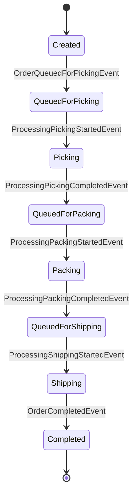

# Architecture -- FlowForge

## Table of Contents

- [1. Target Architecture](#1-target-architecture)
  - [1.1 Product Focus](#11-product-focus)
  - [1.2 Legend](#12-legend)
  - [1.3 Layer and Component Overview with Status](#13-layer-and-component-overview-with-status)
  - [1.4 Core Architecture Rules](#14-core-architecture-rules)
- [2. Capability Details and Feature List](#2-capability-details-and-feature-list)
  - [2.1 Domain Layer](#21-domain-layer)
  - [2.2 Simulation Layer](#22-simulation-layer)
    - [2.2.3 Proposed MVP Event and State Model](#223-proposed-mvp-event-and-state-model)
  - [2.3 Application and Contracts](#23-application-and-contracts)
  - [2.4 Infrastructure Layer](#24-infrastructure-layer)
  - [2.5 Delivery Layer](#25-delivery-layer)
  - [2.6 Quality and Operations](#26-quality-and-operations)
- [3. Dependency Rules](#3-dependency-rules)
- [4. Runtime and Request Flows](#4-runtime-and-request-flows)
  - [4.4 Proposed Order State Diagram](#44-proposed-order-state-diagram)
  - [4.5 Proposed Event Flow](#45-proposed-event-flow)
- [5. Repository Structure](#5-repository-structure)
- [6. Architecture Decision Log](#6-architecture-decision-log)
- [7. Open Questions](#7-open-questions)

---

## 1. Target Architecture

### 1.1 Product Focus

FlowForge is a digital twin application for operational process flows.
The first product slice models a fulfillment pipeline that is easy to understand, visually strong,
and small enough for a two-person team to deliver iteratively.

Initial MVP process:

```text
Order Source -> Picking -> Packing -> Shipping -> Completed
```

FlowForge should make the following visible and understandable:

- order movement through stations
- queue growth and shrinkage
- worker utilization per station
- throughput and lead time behavior
- bottleneck formation under changing parameters

The product strategy is:

- desktop-first for the primary MVP experience
- early API support for control, queries, and future remote scenarios
- shared application/contracts so desktop and API use the same core data access surface

### 1.2 Legend

- 🟢 **GREEN** -- feature is present and usable
- 🟡 **YELLOW** -- feature exists in a starter form or is partially defined
- 🔴 **RED** -- feature is planned but not implemented yet

### 1.3 Layer and Component Overview with Status

```text
+----------------------------------------------------------------------------+
|                              DELIVERY LAYER                                |
|                                                                            |
|  🔴 Desktop Client         🟡 API Host             🟢 CLI Host             |
|  🔴 Process Visualization  🟡 Simulation Control   🟡 Debug Execution      |
|  🔴 KPI Dashboard          🔴 Snapshot Streaming   🔴 Admin Workflows      |
|  🔴 Bottleneck Highlight   🔴 Scenario Endpoints   🔴 Export Commands      |
+----------------------------------------------------------------------------+
|                         INFRASTRUCTURE LAYER                               |
|                                                                            |
|  🟡 DI Wiring              🔴 Scenario Persistence  🔴 Run Export           |
|  🔴 Replay Storage         🔴 Config Models         🔴 Observability        |
|  🔴 API Client Adapters    🔴 Realtime Transport    🔴 Database Support     |
+----------------------------------------------------------------------------+
|                     APPLICATION AND CONTRACTS                              |
|                                                                            |
|  🟡 Application Shell      🔴 Simulation Use Cases  🔴 Shared DTO Contracts |
|  🔴 Snapshot Queries       🔴 KPI Queries           🔴 Scenario Commands     |
|  🔴 Disturbance Commands   🔴 Result/Error Model    🔴 Validation Pipeline   |
+----------------------------------------------------------------------------+
|                           SIMULATION LAYER                                 |
|                                                                            |
|  🔴 Event Queue            🔴 Simulation Runner     🔴 Runtime State        |
|  🔴 Event Dispatch         🔴 Snapshot Builder      🔴 KPI Collection       |
|  🔴 Scheduling             🔴 Disturbance Handling  🔴 Replay Hooks         |
+----------------------------------------------------------------------------+
|                             DOMAIN LAYER                                   |
|                                                                            |
|  🟡 Domain Project         🔴 Order Model           🔴 Station Model        |
|  🔴 Scenario Model         🔴 Capacity Rules        🔴 Processing Profiles  |
|  🔴 Value Objects          🔴 Domain Invariants     🔴 Shared Vocabulary    |
+----------------------------------------------------------------------------+
|                        QUALITY AND OPERATIONS                              |
|                                                                            |
|  🟢 Unit Test Projects     🟢 CI Baseline           🟢 Docker Assets        |
|  🔴 Simulation Tests       🔴 Integration Tests     🔴 Demo Scenarios       |
|  🔴 Architecture Checks    🔴 Telemetry             🔴 Release Flow         |
+----------------------------------------------------------------------------+
```

High-level interaction model:

```text
Desktop Client   API Host   CLI Host
       \            |          /
        \           |         /
         +----------v--------+
         |  Application +    |
         |    Contracts      |
         +----+---------+----+
              |         |
              |         +------------------+
              v                            v
      +-------+--------+         +---------+--------+
      | Simulation     |         | Infrastructure   |
      | event runtime  |         | persistence/etc. |
      +-------+--------+         +------------------+
              |
              v
      +-------+--------+
      | Domain         |
      | business model |
      +----------------+
```

### 1.4 Core Architecture Rules

- The simulation owns the mutable runtime state.
- Desktop and API must consume the same application-facing contracts where practical.
- The UI must never bind directly to mutable simulation collections or runtime internals.
- The API must stay thin and forward use-case behavior inward instead of hosting business rules.
- The MVP should remain concrete and domain-specific instead of becoming a generic simulation engine.
- The current repository scaffold should evolve incrementally toward the target structure.

---

## 2. Capability Details and Feature List

This section lists the expected responsibilities of each component, the current status, and what is
still missing before FlowForge becomes the intended digital twin product.

---

## 2.1 Domain Layer

The domain layer contains the stable business language of FlowForge.
It models the fulfillment process independently from simulation runtime, UI, HTTP, and persistence.

### 2.1.1 Core Domain Modeling

> Business concepts and invariants for the fulfillment domain.

| Feature | Status | Description | What is missing |
|---|---|---|---|
| Domain project baseline | 🟡 | `FlowForge.Domain` exists as the correct place for core business concepts. | Replace placeholder structure with concrete logistics concepts and rules. |
| Order model | 🔴 | Orders should represent the units flowing through the simulated process. | Define identity, lifecycle, timestamps, and allowed state transitions. |
| Station / WorkCenter model | 🔴 | Stations such as Picking, Packing, and Shipping define processing points in the flow. | Model capacities, queue semantics, naming, and process ordering. |
| Scenario model | 🔴 | Scenarios define the configurable setup of a simulation run. | Define scenario identity, station configuration, processing parameters, and defaults. |
| Processing profile | 🔴 | Processing profiles capture expected handling durations and behavior per station. | Decide deterministic vs. stochastic timing and how parameters are expressed. |
| Worker capacity model | 🔴 | Capacity determines how many orders a station can process concurrently. | Introduce worker count, utilization semantics, and capacity-related invariants. |
| Strongly typed value objects | 🔴 | IDs and domain values should avoid primitive-heavy modeling. | Add types such as `OrderId`, `StationId`, `ScenarioId`, and domain-specific value objects. |

### 2.1.2 Domain Quality and Boundaries

> Rules that keep the business model expressive and independent.

| Feature | Status | Description | What is missing |
|---|---|---|---|
| Framework independence | 🟡 | The domain project is currently free from UI and infrastructure concerns. | Preserve this as modeling becomes richer and avoid ORM or transport leakage. |
| Shared business vocabulary | 🔴 | The domain should establish a single language for orders, stations, capacities, and scenarios. | Align namespaces, types, and method names with the agreed process vocabulary. |
| Invariant enforcement | 🔴 | Domain objects should defend valid state and legal transitions. | Move rules into entities/value objects instead of scattering them in handlers or hosts. |
| Extensibility toward richer flows | 🔴 | The model should allow later growth into disturbances, branching, or rework. | Keep the model concrete for MVP while identifying safe extension points. |

---

## 2.2 Simulation Layer

The simulation layer is the runtime heart of FlowForge.
It owns mutable execution state and advances the process through discrete events.

### 2.2.1 Runtime Engine

> Event-based runtime behavior and state transitions.

| Feature | Status | Description | What is missing |
|---|---|---|---|
| Simulation project | 🔴 | A dedicated `FlowForge.Simulation` project should isolate runtime behavior from application orchestration. | Add the project and wire dependencies only to the inner layers it truly needs. |
| Event queue | 🔴 | The queue stores future simulation events ordered by simulation time and priority. | Choose queue structure, ordering rules, and deterministic tie-breaking. |
| Simulation runner | 🔴 | The runner advances simulation time by dequeuing and dispatching events. | Implement lifecycle control, stop/pause behavior, and safe completion semantics. |
| Simulation state | 🔴 | Mutable runtime state should hold active orders, station queues, counters, and current time. | Define internal state objects and keep them hidden from external consumers. |
| Event dispatching | 🔴 | Specific handlers should react to concrete event types. | Introduce dispatcher strategy and handler resolution model. |
| Scheduling abstraction | 🔴 | Handlers should schedule follow-up events through a controlled API. | Define an `ISimulationScheduler` and event creation patterns. |
| Core event types | 🟡 | The MVP event direction is now clearer and based on station-specific queue/start/completion events plus batch generation. | Finalize the concrete event payloads, timing rules, and handler responsibilities. |

### 2.2.2 Snapshots and KPIs

> Read models produced from mutable runtime state.

| Feature | Status | Description | What is missing |
|---|---|---|---|
| Snapshot builder | 🔴 | Immutable snapshots should be built from the internal runtime state. | Define snapshot content, publication trigger, and ownership of mapping logic. |
| Snapshot publication strategy | 🔴 | Clients need regular, stable read access without touching internal state. | Decide fixed interval vs. state-change-based publication and document the default. |
| KPI collector | 🔴 | KPI logic should track throughput, lead time, WIP, queue sizes, and utilization centrally. | Define tracked events, aggregation model, and snapshot output format. |
| Disturbance handling hooks | 🔴 | Later disturbances such as outages or shipping stops should integrate cleanly into the runtime. | Reserve extension points without overbuilding the MVP. |
| Replay support hooks | 🔴 | Later replay or timeline features may depend on run markers or event history. | Decide minimal runtime hooks that do not burden the initial MVP. |

### 2.2.3 Proposed MVP Event and State Model

> Proposed baseline for review. This section reflects the current preferred direction after the latest architecture decisions, but payload shape and some runtime details still need review.

#### Proposed order states

The simplest useful MVP state machine for an order is:

- `Created`
- `QueuedForPicking`
- `Picking`
- `QueuedForPacking`
- `Packing`
- `QueuedForShipping`
- `Shipping`
- `Completed`

Recommended rule:

- queue states are explicit
- processing states are explicit
- movement between stations is represented by station-specific queue/start/completion events, but not as a separate persistent movement state

This keeps KPIs and UI rendering simple because queue length and active work are directly readable
from state.

#### Proposed MVP event catalog

Recommended direction for the fixed MVP flow is station-specific events instead of generic
`OrderQueuedEvent` or generic `ProcessingStartedEvent` / `ProcessingCompletedEvent` pairs.

| Event | Purpose | Typical producer | Typical follow-up |
|---|---|---|---|
| `GenerateSimulationEvent` | Generates the next batch of incoming orders for a time slice. | Simulation bootstrap / generator | Create orders, enqueue picking events, schedule next generation batch |
| `OrderQueuedForPickingEvent` | Creates or activates an order in the first internal queue. | Generator logic | Try start Picking |
| `ProcessingPickingStartedEvent` | Starts picking work for one order. | Picking station capacity logic | Schedule picking completion |
| `ProcessingPickingCompletedEvent` | Finishes picking work and routes to Packing. | Runner after delay | Queue for Packing |
| `OrderQueuedForPackingEvent` | Places an order into the Packing queue. | Picking completion logic | Try start Packing |
| `ProcessingPackingStartedEvent` | Starts packing work for one order. | Packing station capacity logic | Schedule packing completion |
| `ProcessingPackingCompletedEvent` | Finishes packing work and routes to Shipping. | Runner after delay | Queue for Shipping |
| `OrderQueuedForShippingEvent` | Places an order into the Shipping queue. | Packing completion logic | Try start Shipping |
| `ProcessingShippingStartedEvent` | Starts shipping work for one order. | Shipping station capacity logic | Schedule shipping completion |
| `ProcessingShippingCompletedEvent` | Finishes shipping work. | Runner after delay | Complete order |
| `OrderCompletedEvent` | Marks the order as fully completed. | Shipping completion logic | Update KPIs and counters |
| `SnapshotPublishedEvent` | Optional internal marker that a snapshot was produced. | Snapshot policy | Notify consumers / stream / cache |

#### Proposed event handling semantics

- `GenerateSimulationEvent` should be the first event scheduled when a simulation starts.
- The handler for `GenerateSimulationEvent` should create orders for the configured upcoming time slice.
- For each new order, the generator should create the order in status `Created` and then enqueue `OrderQueuedForPickingEvent` at the intended simulated time.
- After generating the current batch, the handler should schedule another `GenerateSimulationEvent` at the end of the next generation window as long as the scenario still produces incoming orders.
- `OrderQueuedForPickingEvent`, `OrderQueuedForPackingEvent`, and `OrderQueuedForShippingEvent` should set the corresponding queue state and trigger a capacity check for the station.
- `Processing...StartedEvent` should reserve a worker at the corresponding station, stamp processing start time, and schedule the matching `Processing...CompletedEvent`.
- `Processing...CompletedEvent` should release capacity, update station counters, and enqueue the next station-specific queue event or `OrderCompletedEvent`.
- `OrderCompletedEvent` should finalize timestamps, counters, and KPI contributions.

#### Why station-specific events are the recommended default

Advantages for the MVP:

- simpler routing because each event has one obvious handler
- easier tracing and replay because event names already encode the station context
- clearer logs and tests for the fixed linear fulfillment flow
- less branching logic inside generic handlers

Trade-off:

- more event types must be maintained
- later highly dynamic routing may want a more generic event model

For the current MVP, the fixed process is known in advance, so the station-specific approach is the
recommended default.

#### Proposed minimal event payload direction

All simulation events should likely share a common base payload such as:

| Field | Purpose |
|---|---|
| `EventId` | Unique technical identifier for tracing and deterministic ordering |
| `ScheduledTime` | Simulation timestamp at which the event becomes due |
| `Priority` | Tie-breaker when several events share the same simulation time |
| `SimulationRunId` | Correlates events to one simulation run |

Station- and order-related events should additionally carry targeted business data such as:

| Event family | Suggested payload |
|---|---|
| `GenerateSimulationEvent` | generation window start/end, batch settings reference, optional scenario snapshot/version |
| `OrderQueuedFor...Event` | `OrderId`, target `StationId`, queue-entered timestamp |
| `Processing...StartedEvent` | `OrderId`, `StationId`, assigned worker slot or capacity token, processing duration |
| `Processing...CompletedEvent` | `OrderId`, `StationId`, processing-start timestamp, processing-end timestamp |
| `OrderCompletedEvent` | `OrderId`, completion timestamp |

Recommended default for the first implementation:

- keep event payloads small and explicit
- do not place full aggregate snapshots inside events
- prefer identifiers plus the minimal deterministic data needed by the handler
- let `SimulationState` remain the source of broader runtime context

#### Proposed exclusions from the first MVP event model

These should stay out of the initial model unless they become necessary during implementation:

- separate movement/animation events only for UI purposes
- failure or outage events
- priority-preemption events
- inventory reservation events
- explicit pause/resume runtime events inside the domain model

---

## 2.3 Application and Contracts

The application layer orchestrates use cases and defines the shared surface that both desktop and
API should use wherever possible.

### 2.3.1 Application Use Cases

> Commands and queries that drive the product behavior.

| Feature | Status | Description | What is missing |
|---|---|---|---|
| Application baseline | 🟡 | `FlowForge.Application` exists and is the right place for orchestration. | Replace shell registrations and placeholders with actual simulation use cases. |
| Simulation lifecycle use cases | 🔴 | Start, pause, reset, and status retrieval should be explicit application operations. | Define commands, handlers/services, and cancellation-aware execution behavior. |
| Scenario loading and configuration | 🔴 | The application should load and modify scenario inputs for a simulation run. | Define request models, validation, and coordination with persistence. |
| Snapshot query use cases | 🔴 | Desktop and API should query the latest immutable simulation state the same way. | Define query contracts and consistent result semantics. |
| KPI query use cases | 🔴 | KPI access should be independent from UI rendering and HTTP transport. | Add query models for summary data and timeline-oriented reads. |
| Disturbance commands | 🔴 | Future disturbances should enter the system through explicit use cases. | Decide whether these belong post-MVP and shape the command model accordingly. |

### 2.3.2 Shared Contracts

> Stable contracts consumed by more than one delivery host.

| Feature | Status | Description | What is missing |
|---|---|---|---|
| Contracts project | 🔴 | A dedicated `FlowForge.Contracts` project should hold shared immutable DTOs. | Add the project and define which contracts are transport-neutral and worth sharing. |
| Snapshot DTOs | 🔴 | Desktop and API should rely on the same core snapshot schema when feasible. | Define station, order, KPI, alert, and simulation status DTOs. |
| Command/query request models | 🔴 | Shared request models can reduce duplication between desktop adapters and API controllers/endpoints. | Decide which requests belong in shared contracts versus delivery-specific models. |
| Result and error model | 🔴 | Use cases should surface consistent success/failure outcomes to all delivery hosts. | Choose a result pattern and error categories for validation, runtime, and not-found cases. |
| Validation pipeline | 🔴 | Input validation should happen before runtime orchestration where appropriate. | Add validators and a consistent failure mapping approach. |

---

## 2.4 Infrastructure Layer

The infrastructure layer implements technical concerns required by the application and delivery
hosts without becoming the owner of business rules.

### 2.4.1 Persistence and Integration

> Technical adapters for scenarios, exports, and later integrations.

| Feature | Status | Description | What is missing |
|---|---|---|---|
| Infrastructure baseline | 🟡 | `FlowForge.Infrastructure` exists as the extension point for technical adapters. | Replace starter registrations with actual persistence and operational services. |
| Scenario persistence | 🔴 | The MVP needs a simple way to save and load scenarios. | Confirm JSON/file-based persistence and implement the first adapter. |
| Run export | 🔴 | Simulation output should be exportable for analysis or demos. | Define export formats, ownership, and application-facing interfaces. |
| Replay storage | 🔴 | Replay may require persistence of snapshots, events, or run summaries. | Decide if replay starts with summaries only or deeper history storage. |
| Configuration models | 🔴 | Runtime configuration should be explicit and validated. | Add options classes, config sections, and defaults for local/dev/demo usage. |
| Database support | 🔴 | A database may become useful for richer scenarios or history later. | Keep the architecture ready without forcing a database into the MVP. |

### 2.4.2 Transport and Operations

> Infrastructure services that support delivery hosts and operations.

| Feature | Status | Description | What is missing |
|---|---|---|---|
| API transport adapters | 🔴 | Shared contracts may require mapping or clients for remote access scenarios. | Introduce only when the API becomes more than a thin local host. |
| Realtime transport | 🔴 | Realtime streaming may later support live snapshots or event feeds. | Choose SignalR/WebSocket strategy when remote clients actually need it. |
| Observability | 🔴 | Logs, metrics, and traces will matter once the runtime becomes more complex. | Define telemetry scope, structured logging, and runtime diagnostics. |

---

## 2.5 Delivery Layer

The delivery layer exposes FlowForge through concrete hosts.
Desktop is the primary MVP experience, but API support starts early and should share the same core
application surface.

### 2.5.1 Desktop Host

> Primary MVP client for visualization and interaction.

| Feature | Status | Description | What is missing |
|---|---|---|---|
| Desktop project | 🔴 | A dedicated `FlowForge.Desktop` host should provide the first real user experience. | Add the project and wire it against shared application/contracts. |
| Process visualization | 🔴 | Users should see stations, queues, and order flow as a coherent process view. | Define scene structure, layout model, and rendering approach. |
| KPI dashboard | 🔴 | KPI cards and charts should explain operational behavior visually. | Define the first KPI widgets and how snapshots update them. |
| Simulation controls | 🔴 | The UI should allow start, pause, reset, and parameter edits. | Implement the interaction model and bind it to shared use cases. |
| Bottleneck highlighting | 🔴 | The UI should make overloaded stations obvious at a glance. | Define the visual rules and required snapshot data. |
| Snapshot consumption | 🔴 | The desktop should obtain data through the same contracts used by the API path where possible. | Decide in-process client adapter shape and update semantics. |

### 2.5.2 API Host

> Early delivery host for shared control and query access.

| Feature | Status | Description | What is missing |
|---|---|---|---|
| API host baseline | 🟡 | `FlowForge.Api` exists and can evolve into an early control/query surface. | Replace placeholder behavior with simulation-specific endpoints. |
| Shared command/query surface | 🟡 | The API should use the same application contracts as the desktop where practical. | Finalize shared DTOs and consistent mapping rules. |
| Simulation control endpoints | 🔴 | The API should expose start, pause, reset, and scenario operations early. | Define route groups, request contracts, and response behavior. |
| Snapshot endpoints | 🔴 | The API should expose current simulation state without leaking internal runtime structures. | Add snapshot query endpoints based on shared contracts. |
| KPI endpoints | 🔴 | KPI summaries and history should be queryable over HTTP. | Define routes, response contracts, and aggregation scope. |
| Realtime snapshot streaming | 🔴 | Later remote clients may require live updates instead of polling. | Introduce streaming only after snapshot contracts are stable. |

### 2.5.3 CLI Host

> Developer and operational support host.

| Feature | Status | Description | What is missing |
|---|---|---|---|
| CLI host baseline | 🟢 | `FlowForge.CLI` exists as a usable delivery shell. | Replace placeholder behavior with concrete simulation-oriented commands. |
| Debug simulation execution | 🟡 | The CLI is a good early tool for validating the runtime before the desktop exists. | Define command structure, outputs, and deterministic scenario execution. |
| Admin and export workflows | 🔴 | The CLI can later support exports, scenario checks, and maintenance tasks. | Add commands once persistence and export flows are defined. |

---

## 2.6 Quality and Operations

This section captures cross-cutting capabilities that support reliability, iteration speed, and demo
readiness.

### 2.6.1 Testing

> Confidence in domain rules, simulation runtime, and application behavior.

| Feature | Status | Description | What is missing |
|---|---|---|---|
| Domain tests project | 🟢 | `tests/FlowForge.Domain.Tests` exists as the place for business-rule tests. | Replace placeholders with behavior-oriented domain tests. |
| Application tests project | 🟢 | `tests/FlowForge.Application.Tests` exists for use-case and orchestration tests. | Add tests for lifecycle commands, queries, and validation. |
| Simulation tests | 🔴 | The runtime engine needs focused tests for event ordering and state transitions. | Add `FlowForge.Simulation.Tests` and cover runner, handlers, and KPI logic. |
| Integration tests | 🔴 | Persistence and API behavior should eventually be validated across boundaries. | Add integration coverage once real adapters and endpoints exist. |
| Demo scenario verification | 🔴 | Demo scenarios should be testable and repeatable. | Define scenario fixtures and expected KPI or flow outcomes. |

### 2.6.2 Build and Runtime Operations

> Shared tooling and operational support.

| Feature | Status | Description | What is missing |
|---|---|---|---|
| CI baseline | 🟢 | CI already provides a starter automation baseline. | Expand checks as simulation, API, and desktop hosts mature. |
| Docker assets | 🟢 | Container assets already exist in the repository scaffold. | Keep them aligned with the actual runtime hosts that remain relevant. |
| Architecture checks | 🔴 | Layer boundaries should stay visible as new projects are added. | Add dependency validation or repository rules when the target structure exists. |
| Telemetry | 🔴 | Runtime diagnostics become important once long-running simulations and API usage grow. | Define logging, metrics, and trace strategy. |
| Release flow | 🔴 | The project will need a reliable packaging and demo/release path later. | Decide packaging strategy for desktop, API, and scenario assets. |

---

## 3. Dependency Rules

Current generated references:

```text
FlowForge.Application       -> FlowForge.Domain
FlowForge.Infrastructure    -> FlowForge.Application, FlowForge.Domain
FlowForge.Api               -> FlowForge.Application, FlowForge.Infrastructure
FlowForge.CLI               -> FlowForge.Domain, FlowForge.Application, FlowForge.Infrastructure
FlowForge.Domain.Tests      -> FlowForge.Domain
FlowForge.Application.Tests -> FlowForge.Application
```

Target direction to preserve while the product grows:

```text
FlowForge.Domain
  <- FlowForge.Simulation
  <- FlowForge.Application
  <- FlowForge.Infrastructure
  <- FlowForge.Api / FlowForge.CLI / FlowForge.Desktop
```

Rules to preserve:

- `Domain` must stay independent.
- `Simulation` owns mutable runtime state and must not depend on delivery hosts.
- `Application` orchestrates simulation and use cases but must not depend on delivery hosts.
- `Desktop` and `Api` should share contracts rather than inventing separate core read models.
- `Infrastructure` implements technical details, not product policy.
- Delivery hosts should remain thin and delegate behavior inward.

---

## 4. Runtime and Request Flows

### 4.1 Desktop Flow

```text
User interaction
  -> Desktop UI
  -> Application command/query contract
  -> Simulation runtime
  -> Snapshot builder
  -> immutable snapshot DTO
  -> Desktop rendering and KPI update
```

### 4.2 API Flow

```text
HTTP request
  -> API endpoint
  -> Application command/query contract
  -> Simulation runtime or query service
  -> immutable DTO/result
  -> HTTP response
```

### 4.3 Simulation Runtime Flow

```text
Start simulation
  -> Runner dequeues next event
  -> Advance simulation time
  -> Dispatch handler
  -> Mutate SimulationState
  -> Schedule follow-up events
  -> Update KPI collector
  -> Build/publish snapshot
```

### 4.4 Proposed Order State Diagram

The following state model is the current recommended MVP proposal for review:



Interpretation:

- entering a queue changes the order into a `QueuedFor...` state
- worker assignment changes the order into an active processing state
- processing completion advances the order to the next queue, except for Shipping which completes it

### 4.5 Proposed Event Flow

The following event chain is the recommended baseline for one normal-order path through the MVP:

```mermaid
flowchart LR
    A[Simulation start] --> B[GenerateSimulationEvent]
    B --> C[Order created with status Created]
    C --> D[OrderQueuedForPickingEvent]
    D --> E[ProcessingPickingStartedEvent]
    E --> F[ProcessingPickingCompletedEvent]
    F --> G[OrderQueuedForPackingEvent]
    G --> H[ProcessingPackingStartedEvent]
    H --> I[ProcessingPackingCompletedEvent]
    I --> J[OrderQueuedForShippingEvent]
    J --> K[ProcessingShippingStartedEvent]
    K --> L[ProcessingShippingCompletedEvent]
    L --> M[OrderCompletedEvent]
    B --> N[Next GenerateSimulationEvent]
```



Recommended review criteria for this model:

- Is explicit queue state useful enough for KPI and UI clarity?
- Is a dedicated `Created` state useful enough as the external entry state before the first internal queue event?
- Should `GenerateSimulationEvent` work with fixed time windows, variable windows, or scenario-defined cadence?
- Which data must be stored directly in each event versus read from `SimulationState`?
- Do we need an explicit `Blocked` or `Delayed` state in MVP phase 1, or only after disturbances are introduced?

---

## 5. Repository Structure

Current repository structure:

```text
.
|-- AGENTS.md
|-- FlowForge.slnx
|-- Directory.Build.props
|-- Directory.Packages.props
|-- global.json
|-- src/
|   |-- FlowForge.Domain/
|   |-- FlowForge.Application/
|   |-- FlowForge.Infrastructure/
|   |-- FlowForge.Api/
|   `-- FlowForge.CLI/
|-- tests/
|   |-- FlowForge.Domain.Tests/
|   `-- FlowForge.Application.Tests/
|-- docs/
|   |-- Architecture.md
|   |-- Roadmap.md
|   |-- Todo.md
|   `-- brainstorm/
`-- .github/workflows/
```

Target product-oriented structure:

```text
src/
  FlowForge.Domain
  FlowForge.Simulation
  FlowForge.Application
  FlowForge.Contracts
  FlowForge.Infrastructure
  FlowForge.Api
  FlowForge.CLI
  FlowForge.Desktop

tests/
  FlowForge.Domain.Tests
  FlowForge.Simulation.Tests
  FlowForge.Application.Tests
```

---

## 6. Architecture Decision Log

| Date | Decision | Reason |
|---|---|---|
| 2026-03-17 | Start with a concrete fulfillment domain instead of a generic simulation platform. | The team needs a small, visual, demo-friendly MVP with clear business value. |
| 2026-03-17 | Use immutable snapshots as the primary backend-to-client contract. | This keeps UI and API decoupled from mutable runtime internals. |
| 2026-03-17 | Build desktop-first, but introduce API support early. | The desktop delivers the strongest MVP demo, while the API prepares shared contracts and future remote access. |
| 2026-03-17 | Keep desktop and API aligned on the same application-facing data contracts where practical. | This reduces duplication and keeps the product surface consistent across delivery hosts. |
| 2026-03-17 | Keep `Created` as the external entry state and use `QueuedForPicking` as the first internal processing state. | This makes the system boundary explicit and preserves a clean distinction between incoming and internally queued orders. |
| 2026-03-17 | Use station-specific queue/start/completion events for the basic MVP flow. | The initial fulfillment process is fixed, so station-specific events simplify routing, tracing, and testing. |
| 2026-03-17 | Introduce `GenerateSimulationEvent` as the first scheduled event of a simulation run. | Batch-oriented generation cleanly controls incoming order creation over simulation time. |

---

## 7. Open Questions

- Should snapshot publication default to fixed intervals, event-triggered updates, or a hybrid model?
- Which DTOs should live in shared contracts versus staying delivery-specific?
- Should `GenerateSimulationEvent` use fixed time windows, scenario-defined cadence, or a pluggable generation strategy?
- Which event payload fields should be mandatory versus derived from `SimulationState` during handling?
- Should disturbances such as outages and shipping stops enter directly after the MVP core, or only after scenario persistence and replay are stable?
