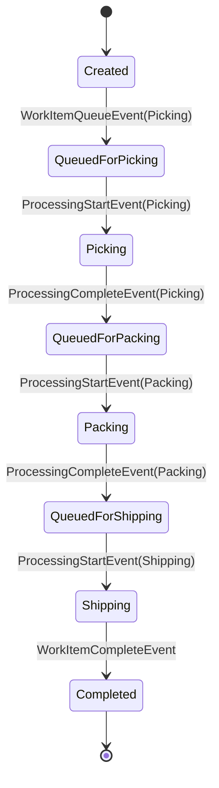

# Simulation Lifecycle Example

This document is informative only.
It illustrates the currently preferred runtime flow and event chain for the MVP.

## Desktop Flow

```text
User interaction
  -> Desktop UI
  -> Application command or query contract
  -> Simulation runtime
  -> Snapshot builder
  -> immutable snapshot DTO
  -> Desktop rendering and KPI update
```

## API Flow

```text
HTTP request
  -> API endpoint
  -> Application command or query contract
  -> Simulation runtime or query service
  -> immutable DTO or result
  -> HTTP response
```

## Simulation Runtime Flow

```text
Start simulation
  -> Bootstrap schedules first event via ISimulationScheduler
  -> SimulationRunner owns priority queue and main loop
  -> Runner dequeues next event
  -> Advance simulation time
  -> Dispatcher resolves handler from EventRoutingKey registry
  -> Dispatch handler
  -> Mutate SimulationState
  -> Schedule follow-up events via ISimulationScheduler
  -> Update KPI collector
  -> Build and publish snapshot
```

## Order State Example



## Event Flow Example

```mermaid
flowchart LR
    A[Simulation start] --> B[GenerateSimulationEvent]
    B --> C[Order created with status Created]
    C --> D[WorkItemQueueEvent stage=Picking]
    D --> E[ProcessingStartEvent stage=Picking]
    E --> F[ProcessingCompleteEvent stage=Picking]
    F --> G[WorkItemQueueEvent stage=Packing]
    G --> H[ProcessingStartEvent stage=Packing]
    H --> I[ProcessingCompleteEvent stage=Packing]
    I --> J[WorkItemQueueEvent stage=Shipping]
    J --> K[ProcessingStartEvent stage=Shipping]
    K --> L[ProcessingCompleteEvent stage=Shipping]
    L --> M[WorkItemCompleteEvent]
    B --> N[Next GenerateSimulationEvent]
```



## Handler to Orchestrator Example

```text
GenerateSimulationEventHandler
  -> IWorkItemProcessOrchestrator.CreateFromGenerationAsync(...)

WorkItemQueueEventHandler
  -> IWorkItemProcessOrchestrator.QueueForStageAsync(...)

ProcessingStartEventHandler
  -> IWorkItemProcessOrchestrator.StartProcessingAsync(...)

ProcessingCompleteEventHandler
  -> IWorkItemProcessOrchestrator.CompleteProcessingAsync(...)

WorkItemCompleteEventHandler
  -> IWorkItemProcessOrchestrator.CompleteWorkItemAsync(...)
```

## `CompleteProcessing` Example

```text
ProcessingCompleteEvent dequeued
  -> handler builds CompleteProcessingCommand
  -> orchestrator loads runtime objects for work item, station, and stage
  -> transition policy validates state and processing token
  -> work item head state is updated
  -> work item tracking closes the active processing segment
  -> station tracking releases busy capacity and updates metrics
  -> stage tracking updates aggregate metrics
  -> KPI collector records incremental facts
  -> routing policy resolves next stage or terminal completion
  -> scheduler enqueues WorkItemQueueEvent or WorkItemCompleteEvent
```
